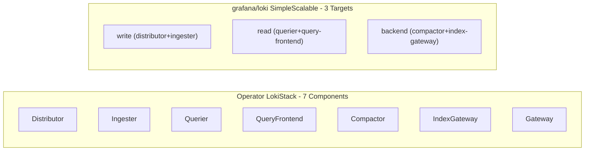

# Replace Loki Operator with Direct grafana/loki Helm Chart

## Why

The current approach requires building a custom OCI chart for the Loki operator (no official Helm chart exists), disabling webhooks, cert-manager, and the gateway -- all of which add fragility. The upstream `grafana/loki` Helm chart (v7.0.0, appVersion 3.6.7) provides a stable, well-maintained alternative that deploys Loki directly in **SimpleScalable** mode (read/write/backend targets) with S3 storage.

## RHOBS LokiStack CR Analysis

Source: [`configuration/resources/clusters/staging/rhobss01uw2/logs/bundle/03-lokistack-LokiStack.yaml`](../../../gitlab/configuration/resources/clusters/staging/rhobss01uw2/logs/bundle/03-lokistack-LokiStack.yaml)

### What the CR configures and how it maps

| LokiStack CR field | grafana/loki Helm equivalent | Notes |

|---|---|---|

| `size: 1x.extra-small` | Explicit `resources` per component | See sizing section below |

| `storage.secret.type: s3` | `loki.storage.type: s3` | Direct S3 config |

| `storage.schemas[0].version: v13` | `loki.schemaConfig.configs[0].schema: v13` | Schema version |

| `storageClassName: gp3-csi` | `*.<component>.persistence.storageClass: gp3` | Per-component PVC |

| `limits.global.ingestion.*` | `loki.limits_config.*` | Rate limits |

| `limits.global.queries.queryTimeout: 5m` | `loki.limits_config.query_timeout: 5m` | Query timeout |

| `limits.global.retention.days: 90` | `loki.limits_config.retention_period: 2160h` + `loki.compactor.retention_enabled: true` | 90 days = 2160h |

| `rules.enabled: false` | `ruler.enabled: false` (chart default) | No ruler needed |

| `template.distributor.replicas: 3` | N/A in SimpleScalable | Covered by `write.replicas` |

| `template.ingester.replicas: 3` | N/A in SimpleScalable | Covered by `write.replicas` |

| `template.querier.replicas: 2` | N/A in SimpleScalable | Covered by `read.replicas` |

| `template.queryFrontend.replicas: 2` | N/A in SimpleScalable | Covered by `read.replicas` |

| `template.*.podAntiAffinity` | `write.affinity`, `read.affinity`, `backend.affinity` | Explicit anti-affinity |

### Key architectural difference: SimpleScalable mode

The grafana/loki chart in **SimpleScalable** mode collapses the 7+ operator components into 3 targets:

- **write** = distributor + ingester
- **read** = querier + query-frontend
- **backend** = compactor + index-gateway + ruler

This is simpler to operate and is Grafana's recommended mode for medium-scale installs (up to ~1 TB/day).



### 1x.extra-small Resource Sizing (from operator source)

The operator defines these for `1x.extra-small`:

- **Distributor**: 1 CPU, 1Gi memory
- **Ingester**: 2 CPU, 8Gi memory, 10Gi PVC + 150Gi WAL
- **Querier**: 1.5 CPU, 3Gi memory
- **QueryFrontend**: 1 CPU, 1Gi memory
- **Compactor**: 1 CPU, 2Gi memory, 10Gi PVC
- **IndexGateway**: 500m CPU, 1Gi memory, 50Gi PVC

For SimpleScalable, combined sizing:

- **write** (distributor+ingester): ~2 CPU, 5Gi memory (weighted toward ingester)
- **read** (querier+query-frontend): ~1.5 CPU, 2Gi memory
- **backend** (compactor+index-gateway): ~1 CPU, 2Gi memory

## Changes Required

### 1. Update `loki/Chart.yaml` to depend on `grafana/loki`

Replace the current custom chart with a dependency on the upstream grafana/loki Helm chart:

```yaml
dependencies:
  - name: loki
    version: "7.0.0"
    repository: "https://grafana.github.io/helm-charts"
```

### 2. Rewrite `loki/values.yaml`

The new values file maps RHOBS LokiStack CR config into grafana/loki chart values:

- `deploymentMode: SimpleScalable`
- `loki.auth_enabled: false` (single-tenant, no gateway)
- `loki.storage.type: s3` with S3 config from templated values
- `loki.schemaConfig` with v13 schema
- `loki.limits_config` with RHOBS ingestion/query/retention limits
- `loki.commonConfig.replication_factor: 2` (matches operator's extra-small)
- Per-target `resources` matching the operator's 1x.extra-small sizing
- Anti-affinity rules on `write`, `read`, `backend` targets
- Disable: `minio`, `monitoring.selfMonitoring`, `lokiCanary`, `test`, `gateway`

### 3. Remove operator-specific templates

- **Delete** `lokistack.yaml` (no more LokiStack CR)
- **Update** `storage-secret.yaml` to create a generic secret with S3 credentials compatible with the grafana/loki chart (environment variable injection instead of operator-managed secret)
- **Keep** `targetgroupbinding.yaml` (update service names to match new chart's services: `loki-write` for distributor, `loki-read` for query-frontend)
- **Keep** `serviceaccount.yaml` (may need updates depending on chart's SA creation)

### 4. Update `loki-operator/` chart

Decide whether to keep or remove the operator chart entirely. If switching fully to the direct Helm chart, the `loki-operator` ArgoCD app and chart directory can be removed.

### 5. ApplicationSet template

Update service names in the ApplicationSet if target group bindings reference operator-generated service names that differ from the grafana/loki chart naming.

## Complete RHOBS LokiStack CR Field-by-Field Audit

Every field from the CR with its Helm chart mapping status:

```
spec.limits.global.ingestion.ingestionBurstSize: 256      -> loki.limits_config.ingestion_burst_size_mb: 256
spec.limits.global.ingestion.ingestionRate: 20             -> loki.limits_config.ingestion_rate_mb: 20
spec.limits.global.ingestion.maxLineSize: 2097152          -> loki.limits_config.max_line_size: 2097152
spec.limits.global.ingestion.perStreamRateLimit: 15        -> loki.limits_config.per_stream_rate_limit: 15MB
spec.limits.global.ingestion.perStreamRateLimitBurst: 30   -> loki.limits_config.per_stream_rate_limit_burst: 30MB
spec.limits.global.otlp.streamLabels.resourceAttributes    -> NOT MAPPED (Vector-side config, not a Loki setting)
spec.limits.global.queries.queryTimeout: 5m                -> loki.limits_config.query_timeout: 5m
spec.limits.global.retention.days: 90                      -> loki.limits_config.retention_period: 2160h + compactor.retention_enabled: true
spec.managementState: Managed                              -> NOT MAPPED (operator-only concept)
spec.rules.enabled: false                                  -> ruler.enabled: false
spec.size: 1x.extra-small                                  -> Explicit resources per target (see below)
spec.storage.schemas[0].effectiveDate: "2025-06-06"        -> loki.schemaConfig.configs[0].from: "2025-06-06"
spec.storage.schemas[0].version: v13                       -> loki.schemaConfig.configs[0].schema: v13
spec.storage.secret.name: loki-default-bucket              -> loki.storage.s3.* (direct config, no operator secret)
spec.storage.secret.type: s3                               -> loki.storage.type: s3
spec.storageClassName: gp3-csi                             -> write/backend.persistence.storageClass: gp3
spec.template.distributor.replicas: 3                      -> write.replicas (merged with ingester)
spec.template.distributor.podAntiAffinity                  -> write.affinity (simplified, see below)
spec.template.ingester.replicas: 3                         -> write.replicas (merged with distributor)
spec.template.ingester.podAntiAffinity                     -> write.affinity (simplified, see below)
spec.template.querier.replicas: 2                          -> read.replicas
spec.template.queryFrontend.replicas: 2                    -> read.replicas
```

All 22 fields accounted for: 19 mapped, 3 not applicable (otlp config, managementState, operator-specific anti-affinity labels).

## Anti-Affinity: Standard Rules for All Targets

Instead of replicating the RHOBS CR anti-affinity (which includes what looks like a copy-paste thanos-receive-ingester rule), we use the same standard pattern for every target -- two `preferredDuringSchedulingIgnoredDuringExecution` rules (same pattern as HyperShift operators):

1. **Hostname anti-affinity** (weight 100): spread pods across different nodes
2. **Zone anti-affinity** (weight 99): spread pods across different AZs

Using `preferred` so a single-replica ephemeral deployment can still schedule on a 1-node cluster. Same pattern for write, read, and backend -- no special cross-component rules.

## Full Proposed `values.yaml` (loki subchart section)

```yaml
loki:
  deploymentMode: SimpleScalable

  loki:
    auth_enabled: false

    commonConfig:
      path_prefix: /var/loki
      replication_factor: 2       # operator 1x.extra-small default

    schemaConfig:
      configs:
        - from: "2025-06-06"      # spec.storage.schemas[0].effectiveDate
          store: tsdb
          object_store: s3
          schema: v13             # spec.storage.schemas[0].version
          index:
            prefix: index_
            period: 24h

    storage:
      type: s3                    # spec.storage.secret.type
      s3:
        region: ""                # templated from global.aws_region
        s3ForcePathStyle: false
      bucketNames:
        chunks: ""                # templated: <cluster_name>-loki-logs-<account_id>
        ruler: ""                 # same bucket

    limits_config:
      ingestion_rate_mb: 20                 # spec.limits.global.ingestion.ingestionRate
      ingestion_burst_size_mb: 256          # spec.limits.global.ingestion.ingestionBurstSize
      max_line_size: 2097152                # spec.limits.global.ingestion.maxLineSize
      per_stream_rate_limit: 15MB           # spec.limits.global.ingestion.perStreamRateLimit
      per_stream_rate_limit_burst: 30MB     # spec.limits.global.ingestion.perStreamRateLimitBurst
      query_timeout: 5m                     # spec.limits.global.queries.queryTimeout
      retention_period: 2160h               # spec.limits.global.retention.days: 90 (90*24h)
      reject_old_samples: true
      reject_old_samples_max_age: 168h
      split_queries_by_interval: 15m
      volume_enabled: true

    compactor:
      retention_enabled: true     # required for retention_period to take effect

    server:
      http_listen_port: 3100
      grpc_listen_port: 9095
      http_server_read_timeout: 600s
      http_server_write_timeout: 600s

  # --- write (distributor + ingester) ---
  # spec.template.distributor.replicas: 3, spec.template.ingester.replicas: 3
  write:
    replicas: 1  # production: 3
    resources:
      requests:
        cpu: "2"
        memory: 5Gi
      limits:
        memory: 8Gi
    persistence:
      size: 10Gi
      storageClass: gp3           # spec.storageClassName: gp3-csi
    affinity:
      podAntiAffinity:
        preferredDuringSchedulingIgnoredDuringExecution:
          - weight: 100
            podAffinityTerm:
              labelSelector:
                matchLabels:
                  app.kubernetes.io/component: write
              topologyKey: kubernetes.io/hostname
          - weight: 99
            podAffinityTerm:
              labelSelector:
                matchLabels:
                  app.kubernetes.io/component: write
              topologyKey: topology.kubernetes.io/zone

  # --- read (querier + query-frontend) ---
  # spec.template.querier.replicas: 2, spec.template.queryFrontend.replicas: 2
  read:
    replicas: 1  # production: 2
    resources:
      requests:
        cpu: "1500m"
        memory: 2Gi
      limits:
        memory: 4Gi
    affinity:
      podAntiAffinity:
        preferredDuringSchedulingIgnoredDuringExecution:
          - weight: 100
            podAffinityTerm:
              labelSelector:
                matchLabels:
                  app.kubernetes.io/component: read
              topologyKey: kubernetes.io/hostname
          - weight: 99
            podAffinityTerm:
              labelSelector:
                matchLabels:
                  app.kubernetes.io/component: read
              topologyKey: topology.kubernetes.io/zone

  # --- backend (compactor + index-gateway) ---
  # ruler disabled via ruler.enabled: false
  backend:
    replicas: 1  # production: 2
    resources:
      requests:
        cpu: "1"
        memory: 2Gi
      limits:
        memory: 4Gi
    persistence:
      size: 10Gi
      storageClass: gp3
    affinity:
      podAntiAffinity:
        preferredDuringSchedulingIgnoredDuringExecution:
          - weight: 100
            podAffinityTerm:
              labelSelector:
                matchLabels:
                  app.kubernetes.io/component: backend
              topologyKey: kubernetes.io/hostname
          - weight: 99
            podAffinityTerm:
              labelSelector:
                matchLabels:
                  app.kubernetes.io/component: backend
              topologyKey: topology.kubernetes.io/zone

  serviceAccount:
    create: true
    name: loki
    annotations: {}               # IRSA annotation templated at runtime

  # --- Disabled components ---
  minio:
    enabled: false
  lokiCanary:
    enabled: false
  test:
    enabled: false
  gateway:
    enabled: false
  monitoring:
    selfMonitoring:
      enabled: false
      grafanaAgent:
        installOperator: false
  rollout_operator:
    enabled: false
  chunksCache:
    enabled: false
  resultsCache:
    enabled: false
  ruler:
    enabled: false                # spec.rules.enabled: false
```

## What is NOT directly mappable from the RHOBS CR (3 fields)

- **`spec.limits.global.otlp.streamLabels.resourceAttributes`**: Operator-specific feature. With the direct chart, label extraction is configured on the Vector/collector side. Loki accepts whatever labels the client sends.
- **`spec.managementState: Managed`**: Operator-only concept (controls whether the operator reconciles the CR). Not applicable with a Helm chart.
- **`spec.template.ingester.podAntiAffinity` thanos-receive-ingester rule**: Appears to be RHOBS-specific (likely a copy-paste from their shared cluster). We use standard hostname + zone rules instead.

## Decision Points

Before implementation, two things to decide:

1. **Keep loki-operator or remove entirely?** If we switch to the direct chart, the operator is no longer needed and its ArgoCD app + chart directory can be deleted.

2. **S3 auth approach**: The grafana/loki chart uses environment variables or `extraEnvFrom` with a Secret for AWS credentials, rather than the operator's custom secret format. With EKS Pod Identity, we can rely on the chart's built-in ServiceAccount + IRSA annotation -- no explicit credentials needed. The chart creates its own ServiceAccount, so we can annotate it with the IAM role ARN via `serviceAccount.annotations`.
