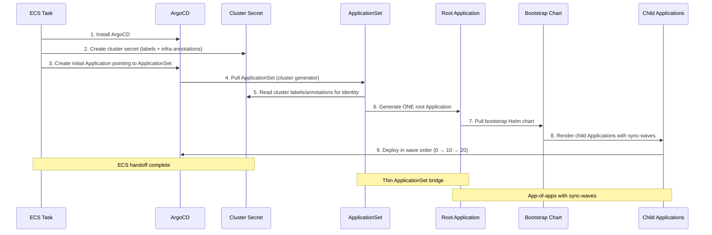
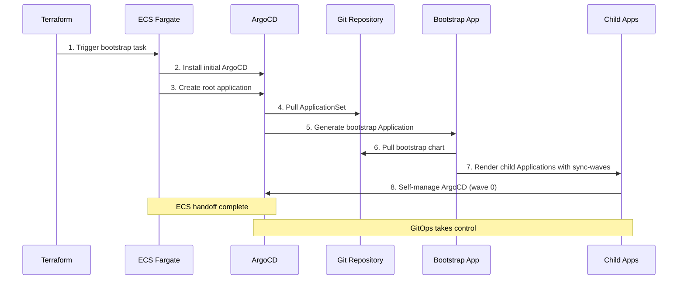

# GitOps Cluster Configuration Architecture

**Last Updated Date**: 2026-05-30

## Summary

The ROSA Regional Platform implements a GitOps cluster configuration system using an industry-standard app-of-apps pattern with a thin ApplicationSet bridge. This architecture enables scalable, versioned, and region-aware deployment of applications across multiple clusters with ordered deployment through sync-waves, while maintaining regional independence and progressive deployment capabilities.

## Context

The ROSA Regional Platform is architected from the ground up as a regionally-distributed system where each cluster (Regional Clusters and Management Clusters) operates independently with its own ArgoCD instance for self-configuration. Within each region (containing 1 Regional Cluster + 1 to N Management Clusters), the configuration management system must support this cluster independence while sharing common application definitions and enabling coordinated deployments across environments.

- **Problem Statement**: How to manage application configuration across multiple regions and environments while supporting independent regional operations, progressive deployments, ordered deployment of dependencies (CRD operators before CRD consumers), and maintaining audit trails for production safety
- **Constraints**: Must integrate with fully private EKS clusters, support region-specific customizations, enable version control for production deployments, provide cross-application deployment ordering, and scale to hundreds of regions
- **Assumptions**: GitOps is the primary deployment mechanism, ArgoCD is the GitOps controller, teams require both development velocity and production safety controls, and CRD-installing operators must deploy before applications consuming those CRDs

## Architecture Overview

The ROSA Regional Platform implements a GitOps cluster configuration system using an app-of-apps pattern with hash-based versioning for production-grade deployment controls while maintaining regional independence. The system uses ArgoCD sync-waves to provide ordered deployment across applications.

### Foundation Concepts

**ECS Bootstrap Process**: Each cluster starts completely private with no external access. AWS ECS Fargate tasks running in the cluster's private subnets provide the secure mechanism to install ArgoCD, create the cluster identity secret, and create the initial Application pointing to the rendered ApplicationSet. Once ECS completes the handoff, ArgoCD takes full control.

**App-of-Apps Pattern**: The industry-standard ArgoCD pattern where a root Application deploys a Helm chart that renders child Application CRs. This enables cross-application deployment ordering through sync-waves, unlike independent Applications generated by an ApplicationSet which have no ordering guarantees.

**ArgoCD Sync-Waves (Two-Level Ordering)**: The app-of-apps pattern provides two independent levels of sync-wave ordering:

1. **Parent level (cross-application)**: Child Application CRs in the bootstrap chart are annotated with sync-wave numbers (0, 10, 20, 30). ArgoCD syncs wave 0 applications first, waits for health, then syncs wave 10, then wave 20, then wave 30. This ensures CRD-installing operators deploy before applications consuming those CRDs.
2. **Child level (intra-application)**: Each child Application runs its own independent sync. Sync-waves inside an individual chart (e.g., CRD at wave -1, controller at wave 0) are evaluated only within that application's sync and don't interact with other applications' internal waves.

**CRD Splitting Pattern**: CRDs that are consumed by other applications are split into standalone charts deployed at wave 0, separate from their operator (deployed at wave 10). This prevents race conditions where an operator and its CRD consumers deploy simultaneously. Examples: `prometheus-crds` installs ServiceMonitor/PrometheusRule CRDs at wave 0; `monitoring` (kube-prometheus-stack with `crds.enabled: false`) deploys the operator at wave 10. This pattern follows gcp-hcp-infra's approach.

**ApplicationSet Bridge**: A thin ApplicationSet uses only the cluster generator to read the cluster identity Secret and generate a single root Application. The ApplicationSet passes infrastructure values from Secret annotations (target group ARNs, KMS key ARNs, DynamoDB config) into the root Application's Helm values.

**Cluster Identity Secret**: Each cluster has a Kubernetes secret that serves as its identity, containing labels (cluster_type, environment, region_deployment, aws_region) and annotations (git repository, revision, infrastructure values from Terraform) that the ApplicationSet uses to configure the root Application.

### GitOps Configuration Flow



ECS bootstrap creates the cluster identity secret and initial Application pointing to the rendered ApplicationSet. The ApplicationSet (cluster generator only) generates a single root Application pointing to `argocd/config/bootstrap/`. The root Application deploys a Helm chart that renders child Application CRs with sync-wave annotations. ArgoCD deploys applications in wave order: wave 0 (operators), wave 10 (CRD consumers), wave 20 (platform services).

### ApplicationSet: Thin Bridge to App-of-Apps

Each cluster uses a **rendered ApplicationSet** that's customized per environment through the render script. The ApplicationSet uses only the cluster generator and generates a single root Application.

**Integration Environment (Live Config)**:

```yaml
# deploy/integration/us-east-1/argocd-bootstrap-regional-cluster/applicationset.yaml
apiVersion: argoproj.io/v1alpha1
kind: ApplicationSet
metadata:
  name: root-applicationset
  namespace: argocd
spec:
  goTemplate: true
  generators:
    - clusters:
        selector:
          matchLabels:
            argocd.argoproj.io/secret-type: cluster
  template:
    metadata:
      name: bootstrap
    spec:
      sources:
        - helm:
            valuesObject:
              git:
                repo: "{{ .metadata.annotations.git_repo }}"
                chartRevision: "{{ .metadata.annotations.git_revision }}"
                valuesRevision: "{{ .metadata.annotations.git_revision }}"
              global:
                cluster_type: "{{ .metadata.labels.cluster_type }}"
                environment: "{{ .metadata.labels.environment }}"
                aws_region: "{{ .metadata.labels.aws_region }}"
                # ... other labels/annotations
              infrastructure:
                api_target_group_arn: "{{ .metadata.annotations.api_target_group_arn }}"
                thanos_kms_key_arn: "{{ .metadata.annotations.thanos_kms_key_arn }}"
                # ... other infrastructure annotations
          path: argocd/config/bootstrap
          repoURL: "{{ .metadata.annotations.git_repo }}"
          targetRevision: "{{ .metadata.annotations.git_revision }}"
        - ref: values
          repoURL: '{{ .metadata.annotations.git_repo | replace "github.com" "github.com:443" }}'
          targetRevision: "{{ .metadata.annotations.git_revision }}"
```

**Staging/Production (Hash-Pinned Config)**:

When `git.revision` is set to a commit hash in `config.yaml`, the rendered ApplicationSet pins `chartRevision` and the bootstrap chart's `targetRevision` to that hash, while `valuesRevision` continues to track the cluster secret's `git_revision` annotation (the branch):

```yaml
valuesObject:
  git:
    chartRevision: "826fa76d08fc2ce87c863196e52d5a4fa9259a82" # Pinned
    valuesRevision: "{{ .metadata.annotations.git_revision }}" # Latest
```

**Key Implementation Details**:

1. **Thin ApplicationSet**: Uses only cluster generator (not matrix generator) to generate a single root Application named `bootstrap`
2. **Infrastructure Value Injection**: ApplicationSet reads Terraform-provided infrastructure values from cluster Secret annotations and injects them into the bootstrap chart's Helm values
3. **Hash Override Mechanism**: Integration uses `git_revision` from cluster secret; staging/production uses hardcoded commit hash from `config.yaml` for `chartRevision`
4. **Dual Source Strategy**: Charts pinned to specific commits for stability; values always use cluster secret revision for latest environment configuration

### App-of-Apps: Bootstrap Chart with Sync-Waves

The root Application deploys the bootstrap Helm chart at `argocd/config/bootstrap/` which renders child Application CRs with sync-wave annotations for ordered deployment.

**Bootstrap Chart Structure**:

```
argocd/config/bootstrap/
├── Chart.yaml
├── values.yaml             # Application topology with sync-wave assignments
└── templates/
    └── application.yaml    # Template rendering child Application CRs
```

**Sync-Wave Assignments** (from `bootstrap/values.yaml`):

| Wave | Name          | Purpose                                      | Applications                                                                                       |
| ---- | ------------- | -------------------------------------------- | -------------------------------------------------------------------------------------------------- |
| 0    | Operators     | CRD installers with zero dependencies        | storageclass, prometheus-crds, cert-manager-crds (MC), external-secrets, eks-nodepool              |
| 10   | Platform      | Configure operators, secondary CRD operators | cert-manager (MC), monitoring (both), thanos-operator (RC), external-secrets-config (both)         |
| 20   | Core Services | Consume CRDs from wave 0+10                  | argocd, alerting-rules (RC), thanos (RC), cloudwatch-exporter, loki (RC), vector, grafana (RC)     |
| 30   | Applications  | Platform workloads                           | hypershift (MC), maestro-server (RC), maestro-agent (MC), platform-api (RC), cluster-cleanup (RC), hyperfleet-\* (RC) |

Each child Application uses the same two-source pattern: Source 1 (Helm chart at `chartRevision`) with chart defaults and rendered environment overrides, Source 2 (values ref at `valuesRevision`). Applications are filtered by `clusterTypes` so regional-cluster and management-cluster apps deploy only where appropriate.

**Sync-Wave Deployment Flow**:

1. **Wave 0**: ArgoCD installs CRDs (prometheus-crds, cert-manager-crds) and core operators (external-secrets), waits for Healthy
2. **Wave 10**: ArgoCD deploys operators with CRDs disabled (monitoring, cert-manager) and configures operators (external-secrets-config), waits for Healthy
3. **Wave 20**: ArgoCD syncs CRD consumers (alerting-rules, thanos, cloudwatch-exporter, argocd self-management), waits for Healthy
4. **Wave 30**: ArgoCD syncs platform services (maestro-server, platform-api, loki, grafana, etc.)

### Configuration Hierarchy

Helm charts use a two-layer configuration system with values flowing through the ApplicationSet bridge:

1. **Chart Defaults**: Each chart defines default values in `argocd/config/*/values.yaml`
2. **Rendered Overrides**: Region/environment-specific values from `deploy/<env>/<region_deployment>/argocd-values-<cluster_type>.yaml` override defaults

**Value Flow**:

```
Cluster Secret (labels + annotations)
  → ApplicationSet (reads Secret, injects into root Application Helm values)
    → Bootstrap Chart (renders child Applications, passes values through)
      → Child Applications (each reads chart defaults + rendered overrides)
```

## Private Cluster GitOps Integration

### Bootstrap-then-Handoff Pattern



**Process**: ECS bootstrap creates a single root ArgoCD application that enables complete self-management:

1. **Initial ArgoCD Installation**: ECS Fargate installs ArgoCD via Helm within the private cluster network
2. **Root Application Creation**: ECS creates the initial Application pointing to the rendered ApplicationSet
3. **ApplicationSet to Root**: ApplicationSet generates a single root Application pointing to the bootstrap chart
4. **Ordered Deployment**: Bootstrap chart renders child Applications with sync-waves; ArgoCD deploys in wave order
5. **Self-Configuration**: ArgoCD Application (wave 0) enables GitOps self-management

### ArgoCD Self-Management

After the initial ECS-based installation, ArgoCD manages its own updates through the `argocd` Application rendered by the bootstrap chart (wave 0). Each cluster's ArgoCD operates independently, enabling autonomous regional operations.

## Progressive Deployment Strategy

The progressive delivery mechanism uses hash-based versioning through `config.yaml`:

```yaml
# Integration: follows HEAD
git:
  revision: main

# Staging: pinned to tested commit
git:
  revision: "826fa76d08fc2ce87c863196e52d5a4fa9259a82"
```

**Flow**: Changes merge to main → integration validates at HEAD → staging pins to validated commit → production promotes pinned commit. The `chartRevision` controls which commit charts are read from, while `valuesRevision` always tracks the cluster's branch for latest environment configuration.

## Cross-Cutting Concerns

### Operability

- Single `config.yaml` provides clear configuration entry point
- Bootstrap chart `values.yaml` serves as single reference for all applications and their deployment order
- Sync-wave annotations in ArgoCD UI show deployment order and health progression
- Git revert enables rapid rollback; wave-based deployment enables stopping rollouts after specific waves

## Alternatives Considered

### 1. Static Repository Paths

**Approach**: Application pointing at static path for all clusters.

**Decision**: Rejected — no region-specific configurations, doesn't support regional independence.

### 2. Dynamic Repository Paths

**Approach**: Render script creates duplicated/rendered apps per region, Application points at rendered path.

**Decision**: Rejected — chart duplication scales poorly, version drift risk between regions.

### 3. ApplicationSet with Dynamic Paths (Unversioned)

**Approach**: Static ApplicationSet with cluster secret for identity, no version pinning.

**Decision**: Rejected — no production deployment controls, no progressive deployment.

### 4. ApplicationSet with Matrix Generator (Previous Approach)

**Approach**: ApplicationSet with matrix generator (cluster × git directories) auto-discovers chart directories and generates ~20 Applications as independent peers with hash-based versioning.

**Pros**:

- Auto-discovery of applications (add directory = deploy app)
- Hash-based versioning for production deployments
- Scales to hundreds of regions

**Cons**:

- **No cross-application ordering**: Generated Applications are independent peers
- **CRD race conditions**: Operators and CRD consumers raced, relying on retry loops (limit 5, exponential backoff)
- **Sync-waves don't work**: Only order resources within a single Application, not across independent Applications

**Decision**: Superseded by app-of-apps pattern — the matrix generator provided auto-discovery and progressive deployment but lacked cross-application ordering. This was the pattern used prior to 2026-05-30.

### 5. ApplicationSet with RollingSync

**Approach**: Keep matrix generator, add `strategy.type: RollingSync` with ordered steps.

**Pros**:

- Minimal change (one file), keeps auto-discovery
- Native ArgoCD feature (GA in 2.9)

**Cons**:

- Newer feature, less well-known by DevOps engineers
- All applications in a step must share the same ApplicationSet template (no per-app customization)
- Ordering defined in strategy block, not visible in application manifests

**Decision**: Rejected — app-of-apps is the industry-standard pattern with better developer familiarity and more per-application flexibility.

## Continuous Delivery Evaluation

The current app-of-apps approach optimizes for testing confidence, operational safety, and deployment ordering reliability. We trade auto-discovery convenience (new apps must be added to `bootstrap/values.yaml`) for deterministic cross-application ordering and elimination of CRD race conditions through sync-waves.

All regions deploy identical, fully-tested chart combinations. A single configuration file (`config.yaml`) controls all deployments with clear integration → staging → production progression.
