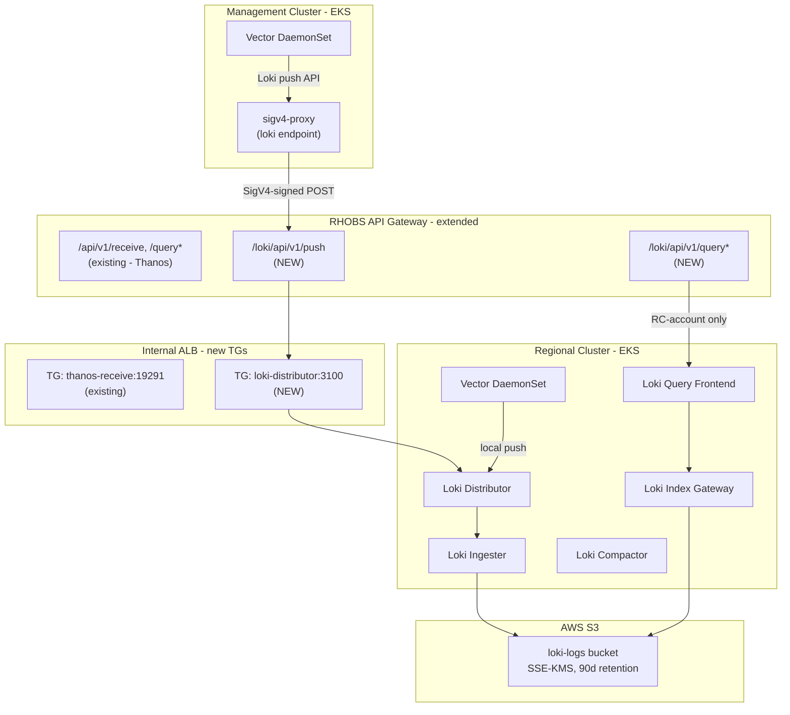

# Loki Logs Infrastructure

**Last Updated**: 2026-05-13

## Summary

Loki is deployed on regional clusters to ingest platform logs from both the Regional Cluster (RC) and Management Clusters (MC), storing them long-term in S3. Two separate ArgoCD applications are deployed: `loki-operator` installs the upstream operator (CRDs, Deployment, RBAC) via an OCI Helm subchart, and `loki` deploys all platform-specific resources (LokiStack CR, S3 secret, Pod Identity SA, ALB TGB). Vector runs as a DaemonSet on both RC and MC for log collection, with MC logs forwarded to the RC via the existing RHOBS API Gateway using SigV4 authentication.

## Context

**Problem**: Regional clusters need centralized platform logs from both RC services and multiple management clusters across AWS accounts. Logs must be queryable via Grafana for operational visibility and retained for compliance. The same SRE team managing the current RHOBS stack (Loki on OpenShift) will manage this platform, so tooling alignment is critical.

**Constraints**:

- FIPS-compliant AWS endpoints (FedRAMP)
- EKS Pod Identity for IAM auth — no static credentials
- KMS encryption at rest
- UBI9 base images with automated security scanning (Clair, ClamAV, Snyk)
- Minimize locally-maintained operator code
- EKS Auto Mode (no OpenShift Cluster Logging Operator available)

**Assumptions**: Management clusters run in separate AWS accounts with no direct network path to the RC. The RC operates a REST API Gateway with VPC Link to internal ALBs (already used for Thanos). Vector is used as the log collector (same engine as RHOBS CLO). Log retention is 90 days (matching RHOBS production LokiStack configuration).

## Decision

Deploy Loki using the **same two-app ArgoCD pattern** as Thanos: `loki-operator` is a thin wrapper chart with a single OCI subchart dependency on the upstream Loki Operator, and `loki` renders only platform-specific resources (LokiStack CR, S3 secret, Pod Identity SA, ALB TGB). IAM is split into two least-privilege roles: a write role for the distributor, ingester, and compactor, and a read-only role for the querier and index gateway. Vector collects logs on both RC and MC, with MC logs forwarded via sigv4-proxy through the existing RHOBS API Gateway.

## Architecture



### Data Flow

1. **RC Vector** collects logs from all pods on the regional cluster via Kubernetes log discovery. It adds `cluster_type: "regional-cluster"` and `cluster_name` labels, then pushes directly to the Loki distributor service (local, no network hop)
2. **MC Vector** collects logs from all pods on each management cluster. It adds `cluster_type: "management-cluster"` and `cluster_name` labels, then pushes to an in-cluster sigv4-proxy
3. **sigv4-proxy** signs the request with SigV4 using Pod Identity credentials and forwards to the RHOBS API Gateway
4. **API Gateway** (REST API v1) authenticates via AWS_IAM and evaluates the resource policy for cross-account access
5. **Loki Distributor** ingests logs and routes to ingesters for WAL and eventual S3 storage

### Cluster Identity

Cluster identity is carried by Vector transforms (labels on log entries) rather than Loki tenant headers. Each Vector instance adds:

- `cluster_name`: the EKS cluster name (unique per cluster)
- `cluster_type`: `regional-cluster` or `management-cluster`

All logs are stored under a single Loki tenant. Cluster identity is enforced at the ingestion layer (IAM resource policy controls which accounts can write) and at the query layer (LogQL filters by `cluster_type` label).

## Alternatives Considered

| Option | Rejected because |
| ------ | ---------------- |
| CloudWatch Logs (EKS native) | Not aligned with RHOBS stack; no LogQL; harder for SRE team to transition |
| Centralized RHOBS cell (status quo) | Requires network path to external OpenShift cluster; adds dependency on separate infrastructure |
| Fluent Bit (EKS add-on) | No native Loki push support; requires output plugin; less alignment with RHOBS Vector |
| Grafana Alloy | Newer tool, less operational experience within the SRE team; Vector is battle-tested in RHOBS |
| Multi-tenant Loki (per-cluster tenants) | Adds operational complexity; label-based isolation is sufficient and matches the Thanos pattern |

## Implementation

### ArgoCD Apps

Four ArgoCD applications are deployed for the logging stack:

| App (`argocd/config/`) | Cluster | Purpose |
| ---------------------- | ------- | ------- |
| `regional-cluster/loki-operator/` | RC | Installs Loki Operator (CRDs, Deployment, RBAC) via OCI subchart |
| `regional-cluster/loki/` | RC | Platform-specific Loki resources (LokiStack CR, S3 secret, SA, TGB) |
| `regional-cluster/vector/` | RC | Vector DaemonSet collecting RC logs, pushing to local Loki |
| `management-cluster/vector/` | MC | Vector DaemonSet collecting MC logs, pushing via sigv4-proxy |

### Templates in `loki/`

| Template | Renders | Why here |
| -------- | ------- | -------- |
| `lokistack.yaml` | `LokiStack` CR | Platform config (size, retention, OTLP labels, storage) |
| `storage-secret.yaml` | `Secret` (S3 config) | S3/KMS config derived from global values |
| `serviceaccount.yaml` | `ServiceAccount` | Pod Identity annotation — AWS-specific |
| `targetgroupbinding.yaml` | `TargetGroupBinding` | ALB wiring — AWS-specific |
| `_helpers.tpl` | Shared label/annotation macros | `SkipDryRunOnMissingResource`, Helm release labels |

### Components

| Component | Purpose | Replicas |
| --------- | ------- | -------- |
| Loki Distributor | Receives and distributes log writes | 3 |
| Loki Ingester | Stores logs in WAL, flushes to S3 | 3 |
| Loki Query Frontend | Caches and splits queries | 2 |
| Loki Querier | Executes LogQL queries | 2 |
| Loki Index Gateway | Serves TSDB index from S3 | 2 |
| Loki Compactor | Compacts index and applies retention | 1 |

### Terraform Resources (`terraform/modules/loki-infrastructure/`)

- `aws_s3_bucket` — `${cluster_id}-loki-logs-${account_id}`, versioning + SSE-KMS + lifecycle (90d)
- `aws_kms_key` — dedicated key for Loki S3 encryption
- `aws_iam_role.loki_writer` — write role for distributor, ingester, and compactor
- `aws_iam_role.loki_reader` — read-only role for querier and index gateway
- `aws_eks_pod_identity_association` — one per operator-managed service account

### API Gateway Extension (`terraform/modules/rhobs-api-gateway/`)

The existing RHOBS API Gateway is extended with Loki paths:

- `POST /loki/api/v1/push` — org-scoped write (MC accounts in same org)
- `GET /loki/api/v1/query`, `GET /loki/api/v1/query_range` — RC-account only
- New ALB target group for Loki distributor (port 3100, ip-type)
- New ALB listener rule routing `/loki/*` to Loki target group
- `binary_media_types` includes `application/x-protobuf` (already configured for Thanos)

### Vector Configuration (RC)

- **Source**: `kubernetes_logs` with auto-discovery of all pods/namespaces
- **Transforms**: add `cluster_type`, `cluster_name`, filter unwanted containers
- **Sink**: `loki` type pointing to local distributor service
- **Deployment**: DaemonSet with tolerations for all taints
- **Resources**: 200m/1Gi request, 750m/2Gi limit (matches RHOBS CLF collector)

### Vector Configuration (MC)

- **Source**: `kubernetes_logs` with auto-discovery
- **Transforms**: add `cluster_type: "management-cluster"`, `cluster_name` from global values
- **Sink**: `loki` type pointing to local sigv4-proxy (`http://sigv4-proxy-logs.logging.svc:8005/prod/loki/api/v1/push`)
- **Deployment**: DaemonSet with tolerations for all taints

### sigv4-proxy Configuration (MC)

Same pattern as the metrics sigv4-proxy:

```yaml
args:
  - --name
  - execute-api
  - --region
  - {{ .Values.global.aws_region | quote }}
  - --host
  - {{ (urlParse (.Values.global.rhobs_api_url)).host }}
  - --port
  - ":8005"
```

No `--strip Content-Encoding` needed for Loki push (Loki uses protobuf with snappy as application-level compression, same as Thanos receive — API Gateway binary_media_types handles passthrough).

### Key Pinned Values

| Setting | Value |
| ------- | ----- |
| Loki Operator bundle | `loki-operator.v6.3.0` |
| Loki Operator image | `quay.io/redhat-services-prod/rhobs-mco-tenant/rhobs-loki-operator` (Konflux) |
| Loki runtime image | `quay.io/redhat-services-prod/rhobs-mco-tenant/rhobs-loki` (Konflux) |
| StorageClass | `gp3` (`ebs.csi.eks.amazonaws.com`, `WaitForFirstConsumer`) |
| LokiStack size | `1x.extra-small` (initial, scale as needed) |
| Schema | `v13` |
| Retention | 90 days |

## Consequences

### Positive

- Unified observability stack (Thanos for metrics, Loki for logs) on the same RC infrastructure
- Same tooling as RHOBS (Vector, Loki Operator, OTLP labels) — SRE team can reuse existing knowledge
- CRDs and operator are not maintained here — upgrading = one OCI chart version bump
- RHOBS UBI9 image meets FedRAMP base image and scanning requirements
- Consistent LogQL queries across old and new platforms (same stream labels)
- API Gateway reuse — no new infrastructure, same security model

### Negative

- Vector standalone requires separate Helm chart management (no CLO abstraction on EKS)
- Loki on EKS Auto Mode may need different resource sizing than RHOBS OpenShift cells
- Initial deploy needs one ArgoCD self-healing retry (CRDs install in cycle 1, CRs apply in cycle 2)
- Upstream OCI chart version must be manually bumped to consume upstream fixes

## Security

- FIPS S3 endpoint auto-selected for all `us-*` regions
- IAM role ARN partition derived from region: `aws-us-gov` for `us-gov-*`, `aws` otherwise
- SSE-KMS encryption for all S3 writes
- EKS Pod Identity — no static credentials
- Two IAM roles enforce least-privilege by component (write vs. read)
- API Gateway resource policy: org-scoped writes, RC-account-only reads
- No direct MC-to-RC network path — all traffic via API Gateway

## Related

- [Thanos Metrics Infrastructure](thanos-metrics-infrastructure.md) — parallel pattern for metrics
- [MC Metrics Pipeline via Remote Write](mc-metrics-remote-write.md) — cross-account ingestion pattern
- [Metrics Platform Overview](monitoring-platform.md) — end-to-end observability architecture
- [rhobs/rhobs-konflux-loki-operator](https://github.com/rhobs/rhobs-konflux-loki-operator)
- [Loki Documentation](https://grafana.com/docs/loki/latest/)
- [Vector Documentation](https://vector.dev/docs/)
- [EKS Pod Identity](https://docs.aws.amazon.com/eks/latest/userguide/pod-identities.html)
