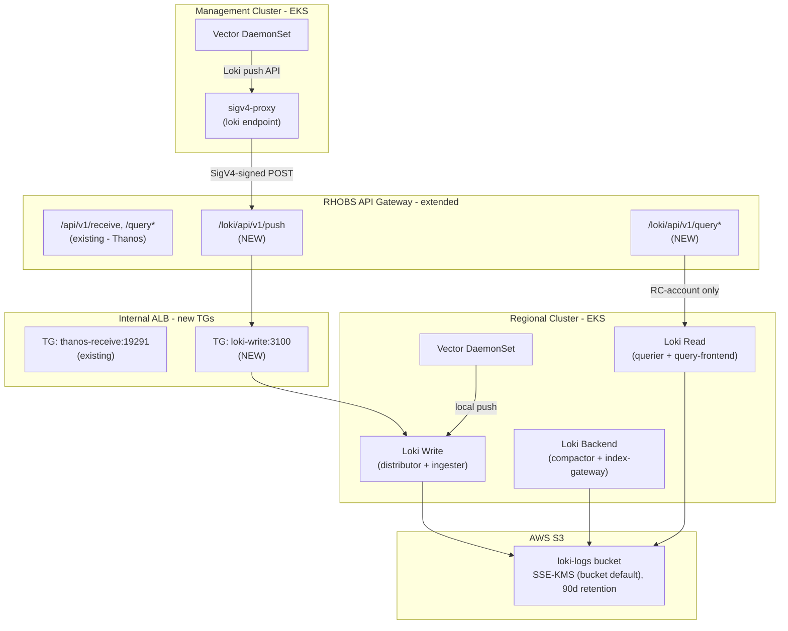

# Loki Logs Infrastructure

**Last Updated**: 2026-05-14

## Summary

Loki is deployed on regional clusters using the upstream `grafana/loki` Helm chart (v7.0.0) in **SimpleScalable** mode. Three target groups (write, read, backend) replace the 7+ microservice components of the operator-based approach. Vector runs as a DaemonSet on both RC and MC for log collection, with MC logs forwarded to the RC via the existing RHOBS API Gateway using SigV4 authentication. All S3 authentication uses EKS Pod Identity via a single shared ServiceAccount.

## Context

**Problem**: Regional clusters need centralized platform logs from both RC services and multiple management clusters across AWS accounts. Logs must be queryable via Grafana for operational visibility and retained for compliance. The same SRE team managing the current RHOBS stack (Loki on OpenShift) will manage this platform, so tooling alignment is critical.

**Constraints**:

- FIPS-compliant AWS endpoints (FedRAMP)
- EKS Pod Identity for IAM auth — no static credentials
- KMS encryption at rest (S3 bucket-level default, transparent to Loki)
- UBI9 base images with automated security scanning (Clair, ClamAV, Snyk)
- Minimize locally-maintained operator code
- EKS Auto Mode (no OpenShift Cluster Logging Operator available)

**Assumptions**: Management clusters run in separate AWS accounts with no direct network path to the RC. The RC operates a REST API Gateway with VPC Link to internal ALBs (already used for Thanos). Vector is used as the log collector (same engine as RHOBS CLO). Log retention is 90 days (matching RHOBS production LokiStack configuration).

## Decision

Deploy Loki using the **upstream `grafana/loki` Helm chart** in SimpleScalable mode as a subchart dependency. A thin wrapper chart provides platform-specific templates (ServiceAccount with Pod Identity, TargetGroupBindings for ALB routing). IAM uses a single write-capable role shared by all Loki pods (compactor needs delete access). S3 encryption is handled at the bucket level via SSE-KMS with a dedicated KMS key — Loki itself needs no KMS configuration. Vector collects logs on both RC and MC, with MC logs forwarded via sigv4-proxy through the existing RHOBS API Gateway.

## Architecture



### Data Flow

1. **RC Vector** collects logs from all pods on the regional cluster via Kubernetes log discovery. It adds `cluster_type: "regional-cluster"` and `cluster_name` labels, then pushes directly to the Loki write service (local, no network hop)
2. **MC Vector** collects logs from all pods on each management cluster. It adds `cluster_type: "management-cluster"` and `cluster_name` labels, then pushes to an in-cluster sigv4-proxy
3. **sigv4-proxy** signs the request with SigV4 using Pod Identity credentials and forwards to the RHOBS API Gateway
4. **API Gateway** (REST API v1) authenticates via AWS_IAM and evaluates the resource policy for cross-account access
5. **Loki Write** ingests logs and routes to ingesters for WAL and eventual S3 storage

### Cluster Identity

Cluster identity is carried by Vector transforms (labels on log entries) rather than Loki tenant headers. Each Vector instance adds:

- `cluster_name`: the EKS cluster name (unique per cluster)
- `cluster_type`: `regional-cluster` or `management-cluster`

All logs are stored under a single Loki tenant. Cluster identity is enforced at the ingestion layer (IAM resource policy controls which accounts can write) and at the query layer (LogQL filters by `cluster_type` label).

## Alternatives Considered

| Option | Rejected because |
| ------ | ---------------- |
| Loki Operator + LokiStack CR | Required building custom OCI chart from upstream kustomize, managing CRDs, cert-manager dependency, webhook configuration; too much locally-maintained scaffolding |
| CloudWatch Logs (EKS native) | Not aligned with RHOBS stack; no LogQL; harder for SRE team to transition |
| Centralized RHOBS cell (status quo) | Requires network path to external OpenShift cluster; adds dependency on separate infrastructure |
| Fluent Bit (EKS add-on) | No native Loki push support; requires output plugin; less alignment with RHOBS Vector |
| Grafana Alloy | Newer tool, less operational experience within the SRE team; Vector is battle-tested in RHOBS |
| Multi-tenant Loki (per-cluster tenants) | Adds operational complexity; label-based isolation is sufficient and matches the Thanos pattern |

## Implementation

### ArgoCD Apps

Three ArgoCD applications are deployed for the logging stack:

| App (`argocd/config/`) | Cluster | Purpose |
| ---------------------- | ------- | ------- |
| `regional-cluster/loki/` | RC | Loki deployment via `grafana/loki` subchart + platform templates (SA, TGB) |
| `regional-cluster/vector/` | RC | Vector DaemonSet collecting RC logs, pushing to local Loki |
| `management-cluster/vector/` | MC | Vector DaemonSet collecting MC logs, pushing via sigv4-proxy |

### Templates in `loki/`

| Template | Renders | Why here |
| -------- | ------- | -------- |
| `serviceaccount.yaml` | `ServiceAccount` | Pod Identity annotation — AWS-specific, shared by all Loki pods |
| `targetgroupbinding.yaml` | `TargetGroupBinding` | ALB wiring — AWS-specific (distributor + query-frontend) |
| `_helpers.tpl` | Shared label/annotation macros | `SkipDryRunOnMissingResource`, Helm release labels |

### SimpleScalable Components

| Target | Contains | Replicas (dev / prod) |
| ------ | -------- | --------------------- |
| Write | Distributor + Ingester | 1 / 3 |
| Read | Querier + Query Frontend | 1 / 2 |
| Backend | Compactor + Index Gateway | 1 / 2 |

### Terraform Resources (`terraform/modules/loki-infrastructure/`)

- `aws_s3_bucket` — `${cluster_id}-loki-logs-${account_id}`, versioning + SSE-KMS + lifecycle (90d)
- `aws_kms_key` — dedicated key for Loki S3 encryption (bucket-level default, transparent to Loki)
- `aws_iam_role.loki_writer` — single IAM role for all Loki pods (S3 read/write/delete + KMS)
- `aws_eks_pod_identity_association` — single association for ServiceAccount `loki` in namespace `loki`

### S3 Authentication

All Loki pods share a single ServiceAccount (`loki`) annotated with the writer IAM role ARN. Authentication flows through EKS Pod Identity:

1. The ServiceAccount annotation (`eks.amazonaws.com/role-arn`) tells EKS to inject AWS credentials
2. AWS SDK in Loki automatically picks up the injected credentials via environment variables
3. S3 bucket default encryption (SSE-KMS) handles encryption/decryption transparently
4. The IAM role has `kms:Decrypt`, `kms:GenerateDataKey`, `kms:DescribeKey` permissions

No explicit S3 credentials, endpoints, or KMS configuration is needed in Loki's Helm values.

### API Gateway Extension (`terraform/modules/rhobs-api-gateway/`)

The existing RHOBS API Gateway is extended with Loki paths:

- `POST /loki/api/v1/push` — org-scoped write (MC accounts in same org)
- `GET /loki/api/v1/query`, `GET /loki/api/v1/query_range` — RC-account only
- New ALB target group for Loki write service (port 3100, ip-type)
- New ALB target group for Loki read service (port 3100, ip-type)
- New ALB listener rule routing `/loki/*` to appropriate target group
- `binary_media_types` includes `application/x-protobuf` (already configured for Thanos)

### Vector Configuration (RC)

- **Source**: `kubernetes_logs` with auto-discovery of all pods/namespaces
- **Transforms**: add `cluster_type`, `cluster_name`, filter unwanted containers
- **Sink**: `loki` type pointing to local write service (`loki-write.loki.svc:3100`)
- **Metrics**: `internal_metrics` source + `prometheus_exporter` sink on port 9090, scraped via ServiceMonitor
- **Deployment**: DaemonSet with tolerations for all taints
- **Resources**: 200m/1Gi request, 750m/2Gi limit (matches RHOBS CLF collector)

### Vector Configuration (MC)

- **Source**: `kubernetes_logs` with auto-discovery
- **Transforms**: add `cluster_type: "management-cluster"`, `cluster_name` from global values
- **Sink**: `loki` type pointing to local sigv4-proxy (`http://sigv4-proxy-logs.logging.svc:8005/prod/loki/api/v1/push`)
- **Deployment**: DaemonSet with tolerations for all taints

### sigv4-proxy Configuration (MC)

Same pattern as the metrics sigv4-proxy:

```yaml
args:
  - --name
  - execute-api
  - --region
  - {{ .Values.global.aws_region | quote }}
  - --host
  - {{ (urlParse (.Values.global.rhobs_api_url)).host }}
  - --port
  - ":8005"
```

No `--strip Content-Encoding` needed for Loki push (Loki uses protobuf with snappy as application-level compression, same as Thanos receive — API Gateway binary_media_types handles passthrough).

### Monitoring

Both Loki and Vector expose Prometheus metrics:

- **Loki**: The `grafana/loki` chart creates ServiceMonitor resources when `monitoring.serviceMonitor.enabled: true`. Metrics are exposed on `/metrics` (port `http-metrics`, 3100) for all three targets (write, read, backend).
- **Vector**: Exposes internal metrics via a `prometheus_exporter` sink on port 9090. A headless Service and ServiceMonitor are defined in the Vector chart templates.

The monitoring stack's Prometheus has `serviceMonitorSelectorNilUsesHelmValues: false` and empty namespace/label selectors, so it auto-discovers ServiceMonitors from any namespace.

### Key Pinned Values

| Setting | Value |
| ------- | ----- |
| Helm chart | `grafana/loki` v7.0.0 |
| Loki version | 3.6.7 |
| Deployment mode | SimpleScalable |
| StorageClass | `gp3` |
| Schema | `v13` |
| Replication factor | 2 |
| Retention | 90 days |

## Consequences

### Positive

- Unified observability stack (Thanos for metrics, Loki for logs) on the same RC infrastructure
- Same query language (LogQL) and tooling as RHOBS — SRE team can reuse existing knowledge
- Direct Helm chart — no operator to build, no CRDs to manage, no webhook/cert-manager dependency
- SimpleScalable mode auto-generates all internal config (compactor, ring, memberlist) — ~200 fewer lines vs. raw Loki config
- S3 encryption is fully transparent at the bucket level — no application-side KMS config needed
- Single IAM role + ServiceAccount simplifies Pod Identity management
- API Gateway reuse — no new infrastructure, same security model

### Negative

- Vector standalone requires separate Helm chart management (no CLO abstraction on EKS)
- Loki on EKS Auto Mode may need different resource sizing than RHOBS OpenShift cells
- Upstream chart version must be manually bumped to consume upstream fixes
- No operator to handle schema migrations or rolling upgrades automatically

## Security

- FIPS S3 endpoint auto-selected for all `us-*` regions
- IAM role ARN partition derived from region: `aws-us-gov` for `us-gov-*`, `aws` otherwise
- SSE-KMS encryption for all S3 writes (bucket-level default with dedicated KMS key)
- EKS Pod Identity — no static credentials
- Single IAM role with S3 read/write/delete + KMS permissions (compactor needs delete for retention)
- API Gateway resource policy: org-scoped writes, RC-account-only reads
- No direct MC-to-RC network path — all traffic via API Gateway

## Related

- [Thanos Metrics Infrastructure](thanos-metrics-infrastructure.md) — parallel pattern for metrics
- [MC Metrics Pipeline via Remote Write](mc-metrics-remote-write.md) — cross-account ingestion pattern
- [Metrics Platform Overview](monitoring-platform.md) — end-to-end observability architecture
- [grafana/loki Helm chart](https://github.com/grafana/helm-charts/tree/main/charts/loki)
- [Loki Documentation](https://grafana.com/docs/loki/latest/)
- [Vector Documentation](https://vector.dev/docs/)
- [EKS Pod Identity](https://docs.aws.amazon.com/eks/latest/userguide/pod-identities.html)
