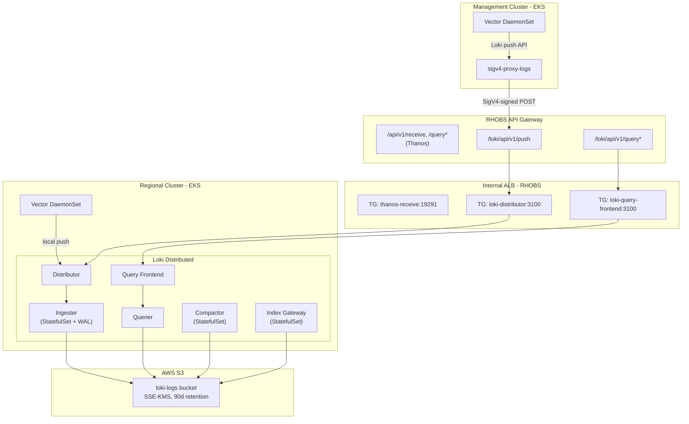

# Loki Logs Infrastructure

**Last Updated**: 2026-04-23

## Summary

Loki is deployed on regional clusters using the upstream `grafana/loki` Helm chart in **Distributed** (microservices) mode. Each Loki component (distributor, ingester, querier, query-frontend, compactor, index-gateway) runs as a separate Deployment or StatefulSet, mirroring the architecture used by RHOBS production LokiStack clusters. Vector runs as a DaemonSet on both RC and MC for log collection, with MC logs forwarded to the RC via the existing RHOBS API Gateway using SigV4 authentication. All S3 authentication uses EKS Pod Identity via a single shared ServiceAccount.

## Context

**Problem**: Regional clusters need centralized platform logs from both RC services and multiple management clusters across AWS accounts. Logs must be queryable via Grafana for operational visibility and retained for compliance. The same SRE team managing the current RHOBS stack (Loki on OpenShift) will manage this platform, so tooling alignment is critical.

**Constraints**:

- FIPS-compliant AWS endpoints (FedRAMP)
- EKS Pod Identity for IAM auth — no static credentials
- KMS encryption at rest (S3 bucket-level default, transparent to Loki)
- UBI9 base images with automated security scanning (Clair, ClamAV, Snyk)
- Minimize locally-maintained operator code
- EKS Auto Mode (no OpenShift Cluster Logging Operator available)

**Assumptions**: Management clusters run in separate AWS accounts with no direct network path to the RC. The RC operates a REST API Gateway with VPC Link to internal ALBs (already used for Thanos). Vector is used as the log collector (same engine as RHOBS CLO). Log retention is 90 days (matching RHOBS production LokiStack configuration).

## Decision

Deploy Loki using the **upstream `grafana/loki` Helm chart** in **Distributed mode** as a subchart dependency. This mode aligns with RHOBS production clusters which use the Loki Operator's `1x.extra-small` size template, deploying each component individually. A thin wrapper chart provides platform-specific templates (ServiceAccount with Pod Identity, TargetGroupBindings for ALB routing, PodDisruptionBudgets). IAM uses a single write-capable role shared by all Loki pods (compactor needs delete access). S3 encryption is handled at the bucket level via SSE-KMS with a dedicated KMS key. Vector collects logs on both RC and MC, with MC logs forwarded via sigv4-proxy through the existing RHOBS API Gateway.

### Why Distributed Mode

The ROSA HCP Regionality platform has the same architecture as RHOBS: one Regional Cluster (analogous to RHOBS Service Cluster) with many Management Clusters, each hosting up to 64 Hosted Control Planes. This means significant log volume from many sources. Distributed mode provides:

- **Per-component scaling**: Independently scale distributors (write path) vs. queriers (read path)
- **Resource isolation**: Ingester memory pressure doesn't affect query-frontend latency
- **Anti-affinity granularity**: Place ingesters on separate nodes for HA without forcing all components apart
- **Operational alignment**: Maps 1:1 to RHOBS LokiStack components, enabling shared runbooks and knowledge
- **Production maturity**: Recommended by Grafana for production deployments at scale

### RHOBS LokiStack Alignment

The following table shows how our Distributed deployment maps to RHOBS production LokiStack resources:

| RHOBS LokiStack Component | Our Helm Chart Component | RHOBS Staging Replicas | Our Ephemeral | Our Production |
| ------------------------- | ------------------------ | --------------------- | ------------- | -------------- |
| distributor | `distributor` | 6 | 1 | 3-6 |
| ingester | `ingester` | 6 | 1 | 3-6 |
| querier | `querier` | 2 | 1 | 2 |
| query-frontend | `queryFrontend` | 2 | 1 | 2 |
| compactor | `compactor` | 1 | 1 | 1 |
| index-gateway | `indexGateway` | 2 | 1 | 2 |
| ruler | (disabled) | 1 | 0 | 0 |
| gateway | (disabled) | 2 | 0 | 0 |

**Not deployed**: `queryScheduler` (not used in RHOBS LokiStack, query-frontend handles queuing internally for single-tenant), `gateway` (single-tenant, auth at API Gateway level), `ruler` (no alerting rules on logs yet).

## Architecture



### Data Flow

1. **RC Vector** collects logs from all pods on the regional cluster via Kubernetes log discovery. It adds `cluster_type: "regional-cluster"` and `cluster_name` labels, then pushes directly to the Loki Distributor service (local, no network hop)
2. **MC Vector** collects logs from all pods on each management cluster. It adds `cluster_type: "management-cluster"` and `cluster_name` labels, then pushes to an in-cluster sigv4-proxy
3. **sigv4-proxy** signs the request with SigV4 using Pod Identity credentials and forwards to the RHOBS API Gateway
4. **API Gateway** (REST API v1) authenticates via AWS_IAM and evaluates the resource policy for cross-account access
5. **Distributor** validates, hashes, and routes log entries to the appropriate **Ingester**
6. **Ingester** writes to a Write-Ahead Log (WAL) on local PVC and periodically flushes chunks to S3

### Cluster Identity

Cluster identity is carried by Vector transforms (labels on log entries) rather than Loki tenant headers. Each Vector instance adds:

- `cluster_name`: the EKS cluster name (unique per cluster)
- `cluster_type`: `regional-cluster` or `management-cluster`

All logs are stored under a single Loki tenant. Cluster identity is enforced at the ingestion layer (IAM resource policy controls which accounts can write) and at the query layer (LogQL filters by `cluster_name`/`cluster_type` labels).

## Alternatives Considered

| Option | Rejected because |
| ------ | ---------------- |
| Loki Operator + LokiStack CR | Required building custom OCI chart from upstream kustomize, managing CRDs, cert-manager dependency, webhook configuration; too much locally-maintained scaffolding |
| SimpleScalable mode | Bundles components together (distributor+ingester in "write"), preventing independent scaling; not aligned with RHOBS production architecture |
| CloudWatch Logs (EKS native) | Not aligned with RHOBS stack; no LogQL; harder for SRE team to transition |
| Centralized RHOBS cell (status quo) | Requires network path to external OpenShift cluster; adds dependency on separate infrastructure |
| Fluent Bit (EKS add-on) | No native Loki push support; requires output plugin; less alignment with RHOBS Vector |
| Grafana Alloy | Newer tool, less operational experience within the SRE team; Vector is battle-tested in RHOBS |
| Multi-tenant Loki (per-cluster tenants) | Adds operational complexity; label-based isolation is sufficient and matches the Thanos pattern |

## Implementation

### ArgoCD Apps

Three ArgoCD applications are deployed for the logging stack:

| App (`argocd/config/`) | Cluster | Purpose |
| ---------------------- | ------- | ------- |
| `regional-cluster/loki/` | RC | Loki deployment via `grafana/loki` subchart + platform templates (SA, TGB, PDB) |
| `regional-cluster/vector/` | RC | Vector DaemonSet collecting RC logs, pushing to local Loki Distributor |
| `management-cluster/vector/` | MC | Vector DaemonSet collecting MC logs, pushing via sigv4-proxy |

### Templates in `loki/`

| Template | Renders | Why here |
| -------- | ------- | -------- |
| `serviceaccount.yaml` | `ServiceAccount` | Pod Identity — AWS-specific, shared by all Loki pods |
| `targetgroupbinding.yaml` | `TargetGroupBinding` x2 | ALB wiring — one for Distributor (push), one for Query Frontend (read) |
| `pdb.yaml` | `PodDisruptionBudget` | One per component, conditional on replicas > 1 |
| `_helpers.tpl` | Shared label/annotation macros | `SkipDryRunOnMissingResource`, Helm release labels |

### Distributed Mode Components

| Component | Type | Purpose | Replicas (eph / prod) | Persistence |
| --------- | ---- | ------- | --------------------- | ----------- |
| Distributor | Deployment | Receives pushes, validates, routes to ingesters | 1 / 3-6 | None |
| Ingester | StatefulSet | WAL + chunk flushing to S3 | 1 / 3-6 | 10Gi gp3 |
| Querier | Deployment | Executes LogQL against stored data | 1 / 2 | None |
| Query Frontend | Deployment | Splits/caches queries, Grafana entry point | 1 / 2 | None |
| Compactor | StatefulSet | Compacts indexes, enforces retention | 1 / 1 | 10Gi gp3 |
| Index Gateway | StatefulSet | Serves index lookups for queriers | 1 / 2 | 50Gi gp3 |

**Replication factor**: 1 for ephemeral (single ingester), 2 for production (must be <= ingester replicas).

### Terraform Resources (`terraform/modules/loki-infrastructure/`)

- `aws_s3_bucket` — `${cluster_id}-loki-logs-${account_id}`, versioning + SSE-KMS + lifecycle (90d)
- `aws_kms_key` — dedicated key for Loki S3 encryption (bucket-level default, transparent to Loki)
- `aws_iam_role.loki_writer` — single IAM role for all Loki pods (S3 read/write/delete + KMS)
- `aws_eks_pod_identity_association` — single association for ServiceAccount `loki` in namespace `loki`

### S3 Authentication

All Loki pods share a single ServiceAccount (`loki`). Authentication flows through EKS Pod Identity:

1. EKS Pod Identity injects AWS credentials into pods via the pod identity agent
2. AWS SDK in Loki automatically picks up the injected credentials via environment variables
3. S3 bucket default encryption (SSE-KMS) handles encryption/decryption transparently
4. The IAM role has `kms:Decrypt`, `kms:GenerateDataKey`, `kms:DescribeKey` permissions

No explicit S3 credentials, endpoints, or KMS configuration is needed in Loki's Helm values.

### API Gateway Extension (`terraform/modules/rhobs-api-gateway/`)

The existing RHOBS API Gateway is extended with Loki paths:

- `POST /loki/api/v1/push` — org-scoped write (MC accounts in same org)
- `GET /loki/api/v1/query`, `GET /loki/api/v1/query_range` — RC-account only (E2E tests, internal tooling)
- ALB target group `loki-distributor` (port 3100, ip-type, health check: `/ready`)
- ALB target group `loki-query-frontend` (port 3100, ip-type, health check: `/ready`)
- ALB listener rules routing `/loki/api/v1/push` to distributor, `/loki/api/v1/query*` to query-frontend
- `binary_media_types` includes `application/x-protobuf` (already configured for Thanos)

### Vector Configuration (RC)

- **Source**: `kubernetes_logs` with auto-discovery of all pods/namespaces
- **Transforms**: add `cluster_type`, `cluster_name`, JSON parsing, filter webhook logs
- **Sink**: `loki` type pointing to local Distributor service (`loki-distributor.loki.svc:3100`)
- **Buffer**: Disk-based with 512MB max size, retry with exponential backoff
- **Metrics**: `internal_metrics` source + `prometheus_exporter` sink on port 9090
- **Deployment**: DaemonSet with tolerations for all taints, liveness/readiness probes via `/health`

### Vector Configuration (MC)

- **Source**: `kubernetes_logs` with auto-discovery
- **Transforms**: add `cluster_type: "management-cluster"`, `cluster_name`, JSON parsing
- **Sink**: `loki` type pointing to local sigv4-proxy (`http://sigv4-proxy-logs.vector.svc:8005/prod/loki/api/v1/push`)
- **Buffer**: Disk-based with 512MB max size, retry with exponential backoff
- **Deployment**: DaemonSet with tolerations for all taints, liveness/readiness probes via `/health`

### sigv4-proxy Configuration (MC)

Same pattern as the metrics sigv4-proxy:

```yaml
args:
  - --name
  - execute-api
  - --region
  - {{ .Values.global.aws_region | quote }}
  - --host
  - {{ (urlParse (.Values.global.rhobs_api_url)).host }}
  - --port
  - ":8005"
  - --strip
  - Content-Encoding
```

The `--strip Content-Encoding` flag prevents signature mismatches when Vector sends compressed payloads.

### Monitoring

Both Loki and Vector expose Prometheus metrics:

- **Loki**: The `grafana/loki` chart creates ServiceMonitor resources when `monitoring.serviceMonitor.enabled: true`. Each component (distributor, ingester, querier, etc.) has its own metrics endpoint on `/metrics` port 3100.
- **Vector**: Exposes internal metrics via a `prometheus_exporter` sink on port 9090. A headless Service and ServiceMonitor are defined in the Vector chart templates.

### Key Configuration

| Setting | Value |
| ------- | ----- |
| Helm chart | `grafana/loki` |
| Deployment mode | Distributed |
| StorageClass | `gp3` |
| Schema | `v13` (TSDB) |
| Replication factor | 1 (eph) / 2 (prod) |
| Retention | 90 days |
| Zone-aware replication | Disabled |
| Gateway (nginx) | Disabled (single-tenant) |
| Query Scheduler | Disabled (not used in RHOBS) |

## Consequences

### Positive

- Unified observability stack (Thanos for metrics, Loki for logs) on the same RC infrastructure
- Same query language (LogQL) and tooling as RHOBS — SRE team can reuse existing knowledge
- Direct Helm chart — no operator to build, no CRDs to manage, no webhook/cert-manager dependency
- Distributed mode maps 1:1 to RHOBS LokiStack component topology — shared runbooks, familiar scaling patterns
- Per-component resource isolation prevents ingester memory pressure from affecting query latency
- S3 encryption is fully transparent at the bucket level — no application-side KMS config needed
- Single IAM role + ServiceAccount simplifies Pod Identity management
- API Gateway reuse — no new infrastructure, same security model

### Negative

- More Kubernetes resources to manage than SimpleScalable (6 Deployments/StatefulSets vs. 3)
- Vector standalone requires separate Helm chart management (no CLO abstraction on EKS)
- Loki on EKS Auto Mode may need different resource sizing than RHOBS OpenShift cells
- Upstream chart version must be manually bumped to consume upstream fixes
- No operator to handle schema migrations or rolling upgrades automatically

## Security

- FIPS S3 endpoint auto-selected for all `us-*` regions
- IAM role ARN partition derived from region: `aws-us-gov` for `us-gov-*`, `aws` otherwise
- SSE-KMS encryption for all S3 writes (bucket-level default with dedicated KMS key)
- EKS Pod Identity — no static credentials
- Single IAM role with S3 read/write/delete + KMS permissions (compactor needs delete for retention)
- API Gateway resource policy: org-scoped writes, RC-account-only reads
- No direct MC-to-RC network path — all traffic via API Gateway

## Related

- [Thanos Metrics Infrastructure](thanos-metrics-infrastructure.md) — parallel pattern for metrics
- [MC Metrics Pipeline via Remote Write](mc-metrics-remote-write.md) — cross-account ingestion pattern
- [Metrics Platform Overview](monitoring-platform.md) — end-to-end observability architecture
- [grafana/loki Helm chart](https://github.com/grafana/helm-charts/tree/main/charts/loki)
- [Loki Documentation](https://grafana.com/docs/loki/latest/)
- [Vector Documentation](https://vector.dev/docs/)
- [EKS Pod Identity](https://docs.aws.amazon.com/eks/latest/userguide/pod-identities.html)
- [RHOBS LokiStack Configuration](https://gitlab.cee.redhat.com/rhobs/configuration) — production sizing reference
