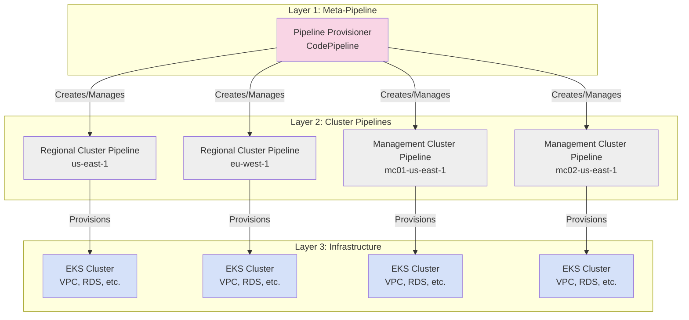
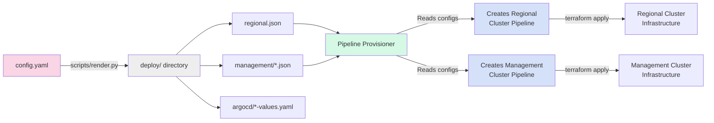
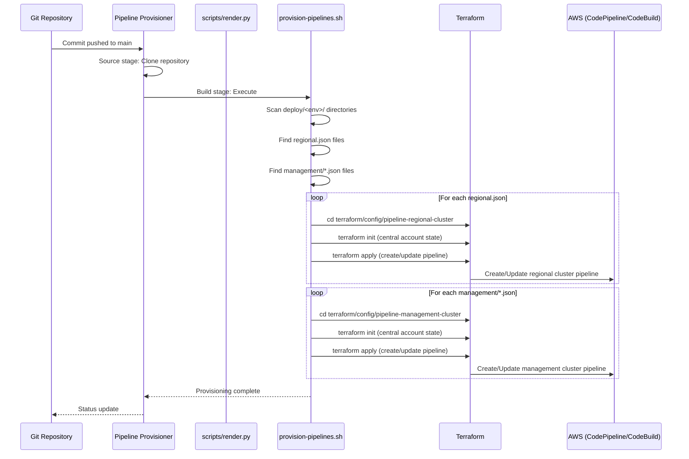
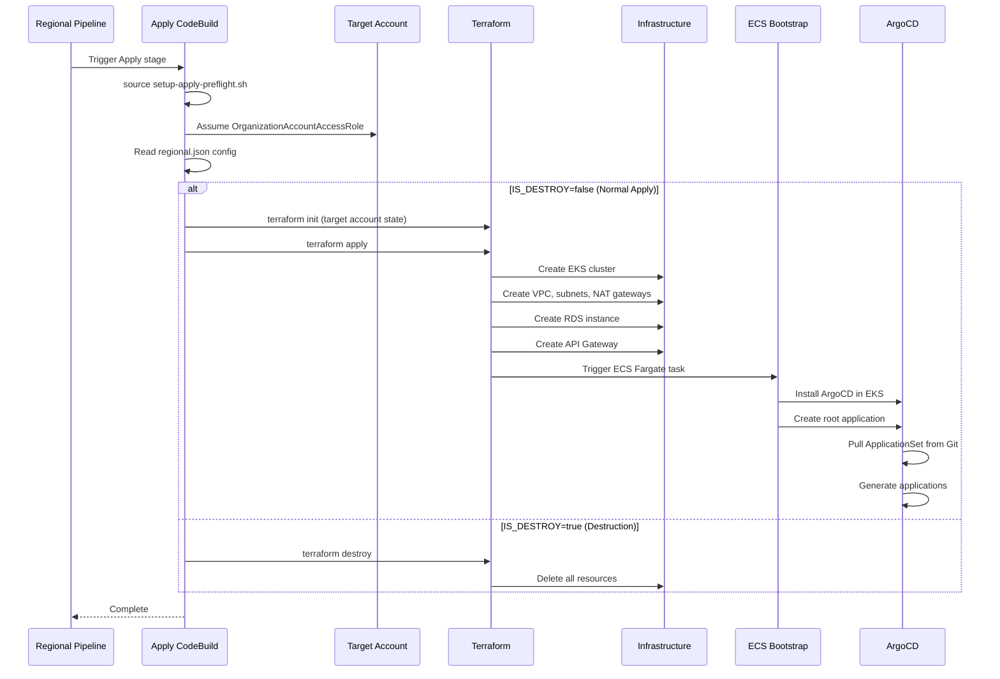
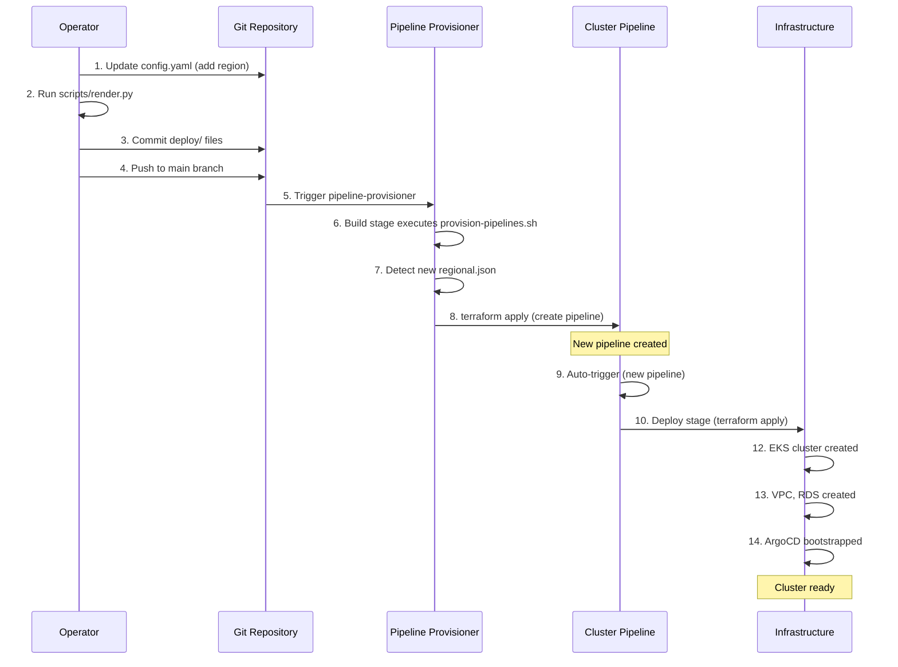
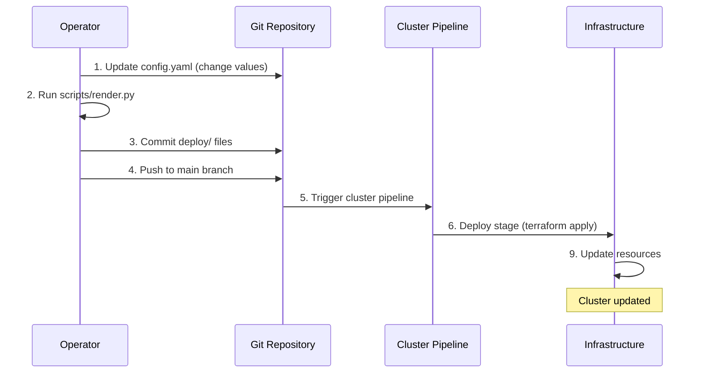
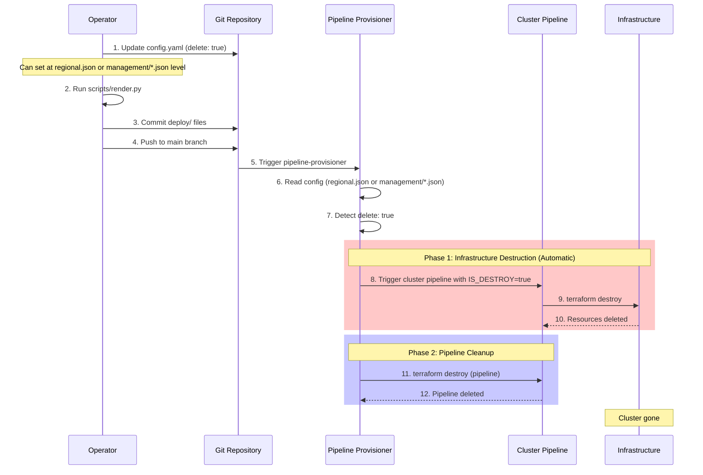

# Pipeline-Based Cluster Lifecycle Management

**Last Updated Date**: 2026-03-03

## Table of Contents

- [Summary](#summary)
- [Context](#context)
- [Architecture Overview](#architecture-overview)
  - [Three-Tier Pipeline Hierarchy](#three-tier-pipeline-hierarchy)
  - [Configuration Flow](#configuration-flow)
- [Layer 1: Pipeline Provisioner (Meta-Pipeline)](#layer-1-pipeline-provisioner-meta-pipeline)
  - [Purpose](#purpose)
  - [Bootstrap vs. Runtime Operation](#bootstrap-vs-runtime-operation)
  - [Architecture](#architecture)
  - [Provisioning Flow](#provisioning-flow)
  - [State Management](#state-management)
- [Layer 2: Cluster Pipelines](#layer-2-cluster-pipelines)
  - [Purpose](#purpose-1)
  - [Architecture](#architecture-1)
  - [Regional Cluster Pipeline](#regional-cluster-pipeline)
  - [Management Cluster Pipeline](#management-cluster-pipeline)
  - [State Management](#state-management-1)
- [End-to-End Cluster Lifecycle](#end-to-end-cluster-lifecycle)
  - [1. Cluster Creation Flow](#1-cluster-creation-flow)
  - [2. Cluster Update Flow](#2-cluster-update-flow)
  - [3. Cluster Deletion Flow (Two-Phase Process)](#3-cluster-deletion-flow-two-phase-process)
- [Design Rationale](#design-rationale)
  - [Why Hierarchical Pipelines?](#why-hierarchical-pipelines)
  - [Why Git-Driven Configuration?](#why-git-driven-configuration)
  - [Why Separate Infrastructure and Pipeline State?](#why-separate-infrastructure-and-pipeline-state)
  - [Why Three-Stage Pipelines?](#why-three-stage-pipelines)
- [Consequences](#consequences)
  - [Positive](#positive)
  - [Negative](#negative)
- [Cross-Cutting Concerns](#cross-cutting-concerns)
  - [Security](#security)
  - [Reliability](#reliability)
  - [Performance](#performance)
  - [Cost](#cost)
  - [Operability](#operability)
- [Future Enhancements](#future-enhancements)
  - [1. Approval Gates for Production](#1-approval-gates-for-production)
  - [2. Progressive Deployment Automation](#2-progressive-deployment-automation)
  - [3. API-Driven Operations (Breaking Change)](#3-api-driven-operations-breaking-change)
- [Appendix: Key File Reference](#appendix-key-file-reference)
  - [Configuration Layer](#configuration-layer)
  - [Pipeline Provisioner (Layer 1)](#pipeline-provisioner-layer-1)
  - [Regional Cluster Pipeline (Layer 2)](#regional-cluster-pipeline-layer-2)
  - [Management Cluster Pipeline (Layer 2)](#management-cluster-pipeline-layer-2)
  - [Terraform Makefiles](#terraform-makefiles)
  - [Helper Scripts](#helper-scripts)
  - [State Files](#state-files)

## Summary

The ROSA Regional Platform implements a hierarchical, Git-driven pipeline architecture where a central pipeline-provisioner dynamically creates and manages per-cluster CodePipeline pipelines based on declarative configuration files, enabling scalable, auditable, and automated infrastructure lifecycle management across multiple AWS accounts and regions.

## Context

The ROSA Regional Platform manages infrastructure across potentially hundreds of AWS regions and accounts. Traditional approaches (manual deployments, centralized CI/CD, imperative scripts) don't scale while maintaining safety, auditability, and regional independence.

- **Problem Statement**: How to safely provision, update, and delete infrastructure across multiple AWS accounts and regions while maintaining audit trails, enabling progressive deployments, supporting cross-account operations, and scaling to hundreds of regions
- **Constraints**: Must work within AWS service limits, support cross-account deployments, integrate with GitOps patterns, maintain security through least privilege, and enable both automated operations and emergency manual intervention
- **Assumptions**: Git is the source of truth, CodePipeline/CodeBuild provide sufficient orchestration capabilities, teams require both development velocity and production safety controls, and infrastructure operations are infrequent enough that pipeline overhead is acceptable

## Architecture Overview

### Three-Tier Pipeline Hierarchy

The platform uses a hierarchical pipeline architecture with three distinct layers:



**Layer 1 - Pipeline Provisioner (Meta-Pipeline)**:
- Single CodePipeline in central account
- **Bootstrap (Manual)**: Created once via `./scripts/bootstrap-central-account.sh` from SRE local terminal
- **Runtime (Automatic)**: Watches Git repository for config changes (triggers on every commit)
- CodeBuild automatically executes `buildspec.yml` → `scripts/provision-pipelines.sh`
- Script reads `deploy/` directory and dynamically creates/updates/deletes Layer 2 pipelines
- **SREs never run provision-pipelines.sh manually** - it runs inside CodeBuild container

**Layer 2 - Cluster Pipelines**:
- One CodePipeline per cluster (regional or management)
- Each pipeline provisions/manages single cluster infrastructure
- Runs in central account but deploys to target accounts
- Three-stage workflow: Source → Deploy → Bootstrap-ArgoCD

**Layer 3 - Infrastructure**:
- Actual AWS resources (EKS, VPC, RDS, etc.)
- Managed by Layer 2 pipelines via Terraform
- Deployed in target accounts (separate from central account)

### Configuration Flow

The entire system is driven by declarative configuration in Git:



**Configuration Hierarchy**:
1. **config.yaml** - Single source of truth for all deployments
2. **scripts/render.py** - Processes config.yaml, generates environment-specific configs
3. **deploy/** - Generated directory structure with per-region/per-cluster configs
4. **Pipeline Provisioner** - Reads deploy/ structure, creates/updates pipelines
5. **Cluster Pipelines** - Read their own configs, provision infrastructure

## Layer 1: Pipeline Provisioner (Meta-Pipeline)

### Purpose

The pipeline-provisioner is a "meta-pipeline" that manages other pipelines. It's responsible for:
- **Creating** new cluster pipelines when new regions/clusters are added to config.yaml
- **Updating** existing pipelines when configuration changes
- **Deleting** pipelines when clusters are marked for deletion

### Bootstrap vs. Runtime Operation

**IMPORTANT**: The pipeline-provisioner operates in two distinct phases:

**Phase 1: One-Time Bootstrap (Manual)**

The pipeline-provisioner pipeline itself must be created once manually by running the bootstrap script from your local terminal:

```bash
# Run once per environment from SRE local terminal
GITHUB_REPOSITORY=openshift-online/rosa-regional-platform \
GITHUB_BRANCH=main \
TARGET_ENVIRONMENT=staging \
./scripts/bootstrap-central-account.sh
```

This bootstrap script performs two critical setup steps:

1. **Creates Terraform State Infrastructure** (via `scripts/bootstrap-state.sh`):
   - S3 bucket for terraform state storage
   - Lockfile-based locking mechanism

2. **Deploys Pipeline Infrastructure** (via `terraform/config/bootstrap-pipeline/`):
   - GitHub CodeStar connection (requires manual authorization in AWS Console)
   - Platform image ECR repository
   - CodePipeline: `pipeline-provisioner`
   - CodeBuild project configured to execute `buildspec.yml`
   - IAM roles for pipeline and build execution
   - S3 bucket for pipeline artifacts

**Post-Bootstrap Manual Step**:
After the script completes, you must manually authorize the GitHub connection:
1. Open AWS Console: https://console.aws.amazon.com/codesuite/settings/connections
2. Find connections in PENDING state
3. Click 'Update pending connection' and authorize with GitHub

**Phase 2: Automatic Runtime Operation (Every Commit)**

After bootstrap, the pipeline-provisioner **runs automatically** on every Git commit:

1. **GitHub webhook** triggers pipeline-provisioner on commit to main branch (configured in `terraform/config/pipeline-provisioner/main.tf`)
2. **Source stage** clones repository from GitHub
3. **Provision stage** invokes CodeBuild project `provisioner` (configured in pipeline definition)
4. **CodeBuild** loads buildspec from `terraform/config/pipeline-provisioner/buildspec.yml`
5. **buildspec.yml** executes: `./scripts/provision-pipelines.sh`
6. **provision-pipelines.sh** reads `deploy/` directory structure
7. **Script** creates/updates/deletes cluster pipelines via terraform

**How buildspec.yml Runs Automatically**:
```yaml
# terraform/config/pipeline-provisioner/buildspec.yml
phases:
  build:
    commands:
      - chmod +x ./scripts/provision-pipelines.sh
      - ./scripts/provision-pipelines.sh  # Executed by CodeBuild container
```

**Key Distinction**:
- ✅ **Bootstrap (Manual, One-Time)**: SRE runs `./scripts/bootstrap-central-account.sh` from local terminal to create the pipeline-provisioner
- ✅ **Runtime (Automatic, Every Commit)**: CodeBuild automatically executes `provision-pipelines.sh` inside AWS container
- ❌ **SREs NEVER run provision-pipelines.sh manually** - it's executed by CodeBuild service

### Architecture

**CodePipeline Stages**:
```yaml
Stages:
  1. Source (GitHub)
     - Watches main branch
     - Triggers on every commit
     - Provides source artifact to Build stage

  2. Build (CodeBuild)
     - Executes buildspec.yml which runs scripts/provision-pipelines.sh
     - Script scans deploy/<env>/<region>/terraform/*.json files
     - For each config file found:
       * Runs terraform init/apply in terraform/config/pipeline-regional-cluster/
       * Runs terraform init/apply in terraform/config/pipeline-management-cluster/
     - Terraform creates/updates/deletes cluster pipelines in AWS
```

**Key Files**:
- **Pipeline Definition**: `terraform/config/pipeline-provisioner/main.tf`
- **Buildspec**: `terraform/config/pipeline-provisioner/buildspec.yml`
- **Provisioning Script**: `scripts/provision-pipelines.sh`

### Provisioning Flow

When a commit is pushed to the Git repository:



**Critical Operations** (from `scripts/provision-pipelines.sh`):

1. **State Bucket Bootstrap**:
   ```bash
   bootstrap_target_state_bucket() {
       local target_account_id="$1"
       local target_region="$2"

       # Create S3 bucket for Terraform state in target account
       # Idempotent - safe to run multiple times
       ./scripts/bootstrap-state.sh "$target_region"
   }
   ```

2. **Config Reading**:
   ```bash
   # Extract configuration from regional.json
   AWS_REGION=$(jq -r '.region // .target_region // "us-east-1"' "$REGIONAL_CONFIG")
   TARGET_ACCOUNT_ID=$(jq -r '.account_id // ""' "$REGIONAL_CONFIG")
   DELETE_FLAG=$(jq -r '.delete // false' "$REGIONAL_CONFIG")
   APP_CODE=$(jq -r '.app_code // "infra"' "$REGIONAL_CONFIG")
   SERVICE_PHASE=$(jq -r '.service_phase // "dev"' "$REGIONAL_CONFIG")
   COST_CENTER=$(jq -r '.cost_center // "000"' "$REGIONAL_CONFIG")
   ENABLE_BASTION=$(jq -r '.enable_bastion // false' "$REGIONAL_CONFIG")
   ```

3. **Pipeline Creation**:
   ```bash
   cd terraform/config/pipeline-regional-cluster

   terraform init \
       -reconfigure \
       -backend-config="bucket=$TF_STATE_BUCKET" \
       -backend-config="key=pipelines/regional-${ENVIRONMENT}-${REGION_DEPLOYMENT}.tfstate" \
       -backend-config="region=$TF_STATE_REGION" \
       -backend-config="use_lockfile=true"

   # Build terraform vars from config
   TF_ARGS=(
       -var="github_repository=${GITHUB_REPOSITORY}"
       -var="target_account_id=${TARGET_ACCOUNT_ID}"
       -var="target_region=${AWS_REGION}"
       -var="target_environment=${ENVIRONMENT}"
       # ... many more vars
   )

   terraform apply -auto-approve "${TF_ARGS[@]}"
   ```

### State Management

**Pipeline Provisioner State** (Central Account):
- **Bucket**: `terraform-state-${CENTRAL_ACCOUNT_ID}`
- **Key**: `pipelines/regional-${ENVIRONMENT}-${REGION_DEPLOYMENT}.tfstate`
- **Contains**: CodePipeline, CodeBuild projects, IAM roles, S3 artifact buckets

**Design Decision**: Pipeline state stored in central account because:
- ✅ Pipelines run in central account
- ✅ Central visibility of all pipelines
- ✅ Consistent access control
- ✅ Simplifies multi-account management

## Layer 2: Cluster Pipelines

### Purpose

Each cluster (regional or management) gets its own dedicated CodePipeline that manages that cluster's infrastructure lifecycle.

### Architecture

**CodePipeline Stages** (3-Stage Workflow):

```yaml
Stages:
  1. Source (GitHub)
     - Watches main branch
     - Provides source code to downstream stages
     - CodeStar connection for GitHub authentication

  2. Deploy (CodeBuild - ApplyInfrastructure)
     - Runs terraform apply to provision infrastructure
     - Can run in DESTROY mode (IS_DESTROY=true)
     - Executes buildspec-provision-infra.yml
     - Creates EKS cluster, VPC, RDS, Platform API, etc.

  3. Bootstrap-ArgoCD (CodeBuild)
     - Triggers ECS Fargate task to install ArgoCD
     - Creates cluster identity secret
     - Deploys root ApplicationSet
     - Hands off cluster management to GitOps
```

### Regional Cluster Pipeline

**Purpose**: Provision Regional Cluster (EKS + VPC + RDS + Platform API)

**Key Files**:
- **Pipeline Definition**: `terraform/config/pipeline-regional-cluster/main.tf`
- **Plan Buildspec**: `terraform/config/pipeline-regional-cluster/buildspec-plan.yml`
- **Apply Buildspec**: `terraform/config/pipeline-regional-cluster/buildspec-provision-infra.yml`
- **Bootstrap Buildspec**: `terraform/config/pipeline-regional-cluster/buildspec-bootstrap-argocd.yml`
- **Infrastructure Module**: `terraform/config/regional-cluster/`

**Apply Stage Flow**:



**Apply Buildspec Details** (`buildspec-provision-infra.yml`):

```yaml
phases:
  build:
    commands:
      - |
        # Pre-flight setup
        source scripts/pipeline-common/setup-apply-preflight.sh

        # Assume target account role
        use_mc_account

        # Configure Terraform backend (state in target account)
        export TF_STATE_BUCKET="terraform-state-${TARGET_ACCOUNT_ID}"
        export TF_STATE_KEY="regional-cluster/${TARGET_ALIAS}.tfstate"
        export TF_STATE_REGION="${TARGET_REGION}"

        # Set Terraform variables
        export TF_VAR_region="${TARGET_REGION}"
        export TF_VAR_app_code="${APP_CODE}"
        export TF_VAR_repository_url="${REPOSITORY_URL}"
        export TF_VAR_container_image="${PLATFORM_IMAGE}"

        # Check if destruction mode is enabled
        if [ "${IS_DESTROY:-false}" == "true" ]; then
            echo "⚠️ DESTRUCTION MODE ENABLED"
            make pipeline-destroy-regional
        else
            make pipeline-provision-regional
        fi
```

**Makefile Targets**:

```makefile
# Provision regional cluster
pipeline-provision-regional: require-tf-state-vars
	@cd terraform/config/regional-cluster && \
		terraform init -reconfigure \
			-backend-config="bucket=$${TF_STATE_BUCKET}" \
			-backend-config="key=$${TF_STATE_KEY}" \
			-backend-config="region=$${TF_STATE_REGION}" \
			-backend-config="use_lockfile=true" && \
		terraform apply -auto-approve

# Destroy regional cluster
pipeline-destroy-regional: require-tf-state-vars
	@cd terraform/config/regional-cluster && \
		terraform init -reconfigure \
			-backend-config="bucket=$${TF_STATE_BUCKET}" \
			-backend-config="key=$${TF_STATE_KEY}" \
			-backend-config="region=$${TF_STATE_REGION}" \
			-backend-config="use_lockfile=true" && \
		terraform destroy -auto-approve
```

### Management Cluster Pipeline

**Purpose**: Provision Management Cluster (EKS for hosting customer control planes)

**Key Files**:
- **Pipeline Definition**: `terraform/config/pipeline-management-cluster/main.tf`
- **Apply Buildspec**: `terraform/config/pipeline-management-cluster/buildspec-provision-infra.yml`
- **Infrastructure Module**: `terraform/config/management-cluster/`

**Similar Flow** to regional cluster but:
- Deploys to management cluster account (may be different from regional account)
- Configures cross-account access to regional cluster
- Registers with CLM (Cluster Lifecycle Manager) in regional cluster
- Uses Maestro for configuration distribution

### State Management

**Infrastructure State** (Target Account):
- **Bucket**: `terraform-state-${TARGET_ACCOUNT_ID}`
- **Regional Key**: `regional-cluster/${TARGET_ALIAS}.tfstate`
- **Management Key**: `management-cluster/${CLUSTER_ID}.tfstate`
- **Contains**: EKS clusters, VPCs, RDS, security groups, etc.

**Design Decision**: Infrastructure state stored in target account because:
- ✅ State co-located with resources
- ✅ Account isolation for security
- ✅ Simplifies account-level disaster recovery
- ✅ Natural boundary for state management

## End-to-End Cluster Lifecycle

### 1. Cluster Creation Flow



**Detailed Steps**:

1. **Operator Updates Config**:
   ```yaml
   # config.yaml
   environments:
     integration:
       region_deployments:
         us-west-2:  # New region
           account_id: "123456789012"
           terraform_vars:
             app_code: "rosa"
             service_phase: "integration"
   ```

2. **Render Script Generates Configs**:
   ```bash
   uv run scripts/render.py

   # Generates:
   # - deploy/integration/us-west-2/terraform/regional.json
   # - deploy/integration/us-west-2/argocd/regional-cluster-values.yaml
   # - deploy/integration/us-west-2/argocd/regional-cluster-manifests/applicationset.yaml
   ```

3. **Commit and Push**:
   ```bash
   git add config.yaml deploy/
   git commit -m "Add us-west-2 regional cluster"
   git push origin main
   ```

4. **Pipeline Provisioner Triggers**:
   - GitHub webhook triggers pipeline-provisioner
   - Source stage clones repository
   - Build stage runs `provision-pipelines.sh`

5. **Pipeline Creation**:
   - Script reads `deploy/integration/us-west-2/terraform/regional.json`
   - Runs `terraform apply` in `terraform/config/pipeline-regional-cluster/`
   - Creates new CodePipeline for us-west-2

6. **Infrastructure Provisioning**:
   - New pipeline auto-triggers (first execution)
   - Deploy stage creates EKS cluster, VPC, RDS, Platform API, etc.
   - Bootstrap-ArgoCD stage installs ArgoCD via ECS Fargate
   - ArgoCD takes over cluster configuration management

7. **Cluster Ready**:
   - Infrastructure provisioned
   - ArgoCD deployed and syncing from Git
   - Platform API available
   - Ready for customer clusters

### 2. Cluster Update Flow



**Update Scenarios**:

- **Configuration Changes**: `app_code`, `service_phase`, tags (non-destructive)
- **Scaling Changes**: RDS instance size, EKS node groups (may require downtime)
- **Feature Flags**: `enable_bastion` (adds/removes resources)
- **Network Changes**: Security groups, VPC configuration (potentially disruptive)

**Safety Mechanisms**:
- **Terraform State**: Prevents unintended resource recreation
- **Git History**: Can revert to previous configuration
- **Progressive Deployment**: Update integration → staging → production
- **Manual Review**: Review terraform changes in CodeBuild logs before they apply

### 3. Cluster Deletion Flow (Two-Phase Process)

The deletion flow is the most complex lifecycle operation due to ordering requirements.



**Critical Design Decision**: Two-phase deletion ensures infrastructure is destroyed **before** the pipeline that manages it.

**Phase 1: Infrastructure Destruction**:

Deletion is **automatic** - triggered by committing `delete: true` to the configuration file.

**Deletion Granularity**: The `delete: true` flag can be set at two different levels:

1. **Regional Cluster Level** - Deletes the entire regional cluster and all its infrastructure:
   ```json
   // deploy/staging/us-west-2/terraform/regional.json
   {
     "region": "us-west-2",
     "account_id": "123456789012",
     "delete": true    // Deletes entire regional cluster
   }
   ```

2. **Management Cluster Level** - Deletes only a specific management cluster:
   ```json
   // deploy/staging/us-west-2/terraform/management/mc01.json
   {
     "name": "mc01",
     "region": "us-west-2",
     "account_id": "123456789012",
     "delete": true    // Deletes only this management cluster
   }
   ```

**Deletion Scope**:

- **Regional Cluster Deletion**: Destroys the Regional Cluster EKS cluster, VPC, RDS database, and all associated infrastructure for that region. This is a complete teardown of the regional control plane.

- **Management Cluster Deletion**: Destroys only the specified Management Cluster EKS cluster and its VPC. The Regional Cluster and other Management Clusters in the same region remain intact.

When the pipeline-provisioner detects `delete: true`, it triggers the cluster pipeline with `IS_DESTROY=true`. The cluster pipeline's buildspec then runs:

```bash
# From terraform/config/pipeline-regional-cluster/buildspec-provision-infra.yml
# (similar for pipeline-management-cluster)
if [ "${IS_DESTROY:-false}" == "true" ]; then
    echo "⚠️ DESTRUCTION MODE ENABLED"
    make pipeline-destroy-regional  # or pipeline-destroy-management
    echo "✅ Cluster destroyed successfully."
fi
```

**No manual intervention required** - the entire deletion flow is Git-driven.

**Phase 2: Pipeline Cleanup**:

After infrastructure destruction completes, the pipeline-provisioner cleans up pipeline resources:

```bash
# scripts/provision-pipelines.sh
destroy_pipeline() {
    local pipeline_type="$1"

    echo "⚠️  Processing DELETE request for $pipeline_type pipeline..."
    echo "   This will only destroy pipeline resources."
    echo "   Infrastructure must be destroyed separately."

    # Destroy pipeline resources
    terraform destroy -auto-approve "${TF_ARGS[@]}"
}

# Called from main loop
if [ "$DELETE_FLAG" == "true" ]; then
    if destroy_pipeline "regional"; then
        echo "✅ Regional pipeline cleanup complete"
    else
        echo "❌ Failed to destroy regional pipeline"
        exit 1
    fi
fi
```

**Why Two Phases?**

1. **State File Integrity**: Infrastructure state must be accessible during destruction
2. **Audit Trail**: Pipeline logs must persist through infrastructure cleanup
3. **Safety**: Prevents orphaned resources from premature pipeline deletion
4. **Error Recovery**: Can manually intervene if infrastructure destruction fails

## Design Rationale

### Why Hierarchical Pipelines?

**Alternative 1: Single Monolithic Pipeline**
```
Single pipeline manages all clusters
├── Plan all clusters
└── Apply all clusters
```

**Rejected Because**:
- ❌ All-or-nothing deployment (can't deploy single region)
- ❌ Blast radius too large (failure affects all regions)
- ❌ No parallelization (sequential deployment is slow)
- ❌ State management complexity (single state file for everything)
- ❌ Doesn't scale to hundreds of regions

**Alternative 2: Manual Pipeline Creation**
```
Operators manually create pipelines via AWS Console/CLI
```

**Rejected Because**:
- ❌ Manual toil doesn't scale
- ❌ Configuration drift (inconsistent pipeline definitions)
- ❌ No audit trail for pipeline changes
- ❌ Error-prone (human mistakes in configuration)
- ❌ Doesn't integrate with GitOps patterns

**Chosen: Hierarchical Meta-Pipeline**
```
Pipeline-Provisioner (Meta)
├── Regional Cluster Pipeline 1
├── Regional Cluster Pipeline 2
├── Management Cluster Pipeline 1
└── Management Cluster Pipeline 2
```

**Advantages**:
- ✅ **Scalability**: Add regions by updating config file
- ✅ **Parallelization**: Each cluster deploys independently
- ✅ **Isolation**: Failure in one region doesn't affect others
- ✅ **GitOps**: Pipeline creation/deletion driven by Git
- ✅ **Audit Trail**: All changes tracked in Git
- ✅ **Progressive Deployment**: Can update single region at a time
- ✅ **State Isolation**: Separate state files per cluster

### Why Git-Driven Configuration?

**Alternative 1: API-Driven**
```python
# Create cluster via API call
rosa_api.create_cluster(
    region="us-east-1",
    account_id="123456789012",
    ...
)
```

**Rejected Because**:
- ❌ No built-in audit trail (must add custom logging)
- ❌ No peer review workflow (direct execution)
- ❌ No rollback capability (can't "undo" API call)
- ❌ Configuration drift (current state vs. desired state)
- ❌ Doesn't integrate with GitOps patterns

**Alternative 2: Terraform Directly**
```bash
# Operators run terraform manually
cd terraform/config/regional-cluster
terraform apply
```

**Rejected Because**:
- ❌ Requires operator access to AWS credentials
- ❌ No centralized execution (runs on laptops)
- ❌ Inconsistent environment (different terraform versions)
- ❌ No approval workflow built-in
- ❌ Doesn't scale to multiple operators/regions

**Chosen: Git-Driven Pipelines**
```yaml
# config.yaml (Git)
environments:
  production:
    region_deployments:
      us-east-1:
        account_id: "123456789012"
```

**Advantages**:
- ✅ **Audit Trail**: Git commits show who, when, what, why
- ✅ **Peer Review**: Pull requests enable team review
- ✅ **Rollback**: Git revert provides escape hatch
- ✅ **Declarative**: Configuration expresses desired state
- ✅ **Versioned**: Can reference specific commits for production
- ✅ **GitOps Native**: Consistent with overall platform architecture

### Why Separate Infrastructure and Pipeline State?

**Pipeline State** (Central Account):
- `terraform-state-${CENTRAL_ACCOUNT_ID}/pipelines/regional-${ENV}-${REGION}.tfstate`

**Infrastructure State** (Target Account):
- `terraform-state-${TARGET_ACCOUNT_ID}/regional-cluster/${ALIAS}.tfstate`

**Rationale**:
- ✅ **Locality**: State co-located with resources it manages
- ✅ **Security**: Target account owns its infrastructure state
- ✅ **Isolation**: Account-level blast radius containment
- ✅ **Disaster Recovery**: Can recover account independently
- ✅ **Access Control**: Different teams can have different access

**Alternative (Single Central State)** - Rejected:
- ❌ Central account becomes single point of failure
- ❌ State file size grows unbounded
- ❌ Locking contention across all operations
- ❌ Breaks account isolation model

### Why Three-Stage Pipelines?

**Source → Deploy → Bootstrap-ArgoCD**

**Rationale**:
- ✅ **Separation of Concerns**: Infrastructure provisioning (Deploy) separated from application deployment (Bootstrap)
- ✅ **Clear Handoff Point**: Bootstrap stage marks transition from infrastructure to GitOps control
- ✅ **Independent Failure Domains**: Infrastructure can succeed even if ArgoCD bootstrap fails
- ✅ **Debugging**: Can investigate infrastructure issues before GitOps complexity
- ✅ **Audit**: Clear stages in pipeline history show what succeeded/failed

**Why No Separate Plan Stage?**:
- Deploy stage logs show terraform plan output before applying
- Terraform state prevents unintended resource recreation
- Git review provides safety before changes reach pipeline
- Separate plan stage adds latency without significant safety benefit for automated deployments

**Alternative (Two-Stage: Source → Deploy+Bootstrap)** - Rejected:
- ❌ Cannot investigate infrastructure issues independently
- ❌ Harder to debug GitOps bootstrap failures
- ❌ No clear handoff point between infrastructure and application layers

## Consequences

### Positive

**Scalability**:
- ✅ Add regions by updating single config file
- ✅ Pipelines created/deleted automatically
- ✅ Each region operates independently
- ✅ Scales to hundreds of regions without manual intervention

**Safety**:
- ✅ Git provides audit trail of all changes
- ✅ Pull requests enable peer review before merge
- ✅ Terraform state prevents unintended resource recreation
- ✅ State isolation prevents cross-cluster impact
- ✅ Two-phase deletion prevents orphaned resources
- ✅ Progressive deployment (integration → staging → production)

**Operability**:
- ✅ Declarative configuration reduces cognitive load
- ✅ Consistent deployment mechanism across environments
- ✅ Self-service for operators (edit config, push to Git)
- ✅ Clear separation of concerns (config vs. infrastructure)

**Auditability**:
- ✅ Git commits show who changed what and when
- ✅ CodeBuild logs show execution details
- ✅ CloudTrail records all AWS API calls
- ✅ Pull request history preserves discussion/rationale

**Regional Independence**:
- ✅ Each region has dedicated pipeline
- ✅ Failures isolated to single region
- ✅ Can update regions independently
- ✅ Progressive deployment supported (integration → staging → production)

### Negative

**Complexity**:
- ❌ Three-tier architecture requires deep understanding
- ❌ Debugging failures requires navigating multiple layers
- ❌ State management split across accounts (more to track)
- ❌ Two-phase deletion adds operational overhead

**Latency**:
- ❌ Git workflow adds delays vs. direct API calls
- ❌ Pipeline execution slower than direct terraform
- ❌ Must wait for pipeline-provisioner before cluster pipeline runs
- ❌ Sequential stages (Source → Deploy → Bootstrap) add time vs. single-stage approach

**Operational Overhead**:
- ❌ Must run render script before committing
- ❌ Pipeline provisioner must run before cluster changes apply
- ❌ Two-phase deletion adds complexity (infrastructure, then pipeline)
- ❌ State bucket bootstrap required for new accounts

**Limitations**:
- ❌ Cannot create clusters without Git commit (no API)
- ❌ Infrastructure deletion requires Git commit with `delete: true` (no API)
- ❌ Pipeline state and infra state in different accounts (complexity)
- ❌ CodePipeline service limits (max pipelines per account)

**Cost**:
- ❌ One pipeline per cluster adds AWS costs
- ❌ Pipeline execution charges even for no-op runs
- ❌ S3 artifact storage accumulates over time
- ❌ CloudWatch logs retention costs

## Cross-Cutting Concerns

### Security

**Authentication & Authorization**:
- **GitHub**: CodeStar Connections provide OAuth authentication
- **AWS Cross-Account**: OrganizationAccountAccessRole for target account access
- **IAM Roles**: Least-privilege service roles for CodeBuild projects
- **MFA**: Can require MFA for Git commits (GitHub protected branches)

**Least Privilege**:
- **Pipeline Provisioner**: Only creates/updates/deletes pipelines (not infrastructure)
- **Cluster Pipelines**: Can only affect single cluster's infrastructure
- **State Isolation**: Each cluster state file has dedicated access policies
- **Account Boundaries**: Cross-account access explicitly configured

**Audit Trail**:
- **Git Commits**: SHA, author, timestamp, message preserved forever
- **CodeBuild Logs**: Immutable execution logs in CloudWatch (90-day retention)
- **CloudTrail**: API-level audit for all AWS operations
- **Pull Request History**: Review comments and approvals preserved

**Secrets Management**:
- **GitHub Token**: Stored in AWS Secrets Manager (CodeStar connection)
- **Cross-Account Roles**: No long-lived credentials (STS assume-role)
- **SSM Parameters**: Sensitive config values referenced as `ssm:///path`
- **Environment Variables**: Passed securely through CodeBuild

### Reliability

**Fault Isolation**:
- Each cluster pipeline operates independently
- Failure in one region doesn't affect others
- State files isolated per cluster
- Retry logic for transient failures

**Idempotency**:
- Terraform ensures apply operations are idempotent
- State bucket bootstrap can be safely re-run
- Pipeline creation/update operations are idempotent
- Deletion operations safe to retry

**Recovery**:
- **Git Revert**: Can rollback configuration changes
- **State Backups**: S3 versioning on state buckets
- **Manual Intervention**: Can run terraform directly if pipeline fails
- **Emergency Access**: Can assume roles manually for troubleshooting

**Observability**:
- **Pipeline Status**: CodePipeline console shows execution history
- **Build Logs**: CodeBuild logs in CloudWatch
- **Terraform Output**: Plan and apply output in logs
- **Metrics**: Can add CloudWatch metrics for pipeline success/failure rates

### Performance

**Pipeline Execution Time**:
- **Pipeline Provisioner**: 5-10 minutes (scans configs, updates pipelines)
- **Cluster Pipeline - Deploy**: 30-60 minutes (terraform apply with EKS cluster creation)
- **Cluster Pipeline - Bootstrap**: 5-10 minutes (ArgoCD installation via ECS)
- **Total (New Cluster)**: ~40-80 minutes from Git commit to ready cluster

**Parallelization**:
- Multiple cluster pipelines run concurrently
- Pipeline provisioner processes regions in sequence (acceptable)
- Terraform parallelizes resource creation within cluster

**Optimization Opportunities**:
- Cache terraform providers in CodeBuild
- Use terraform remote state caching
- Parallelize pipeline provisioner (currently sequential)
- Pre-warm EKS AMIs for faster cluster creation

### Cost

**Per-Cluster Pipeline Costs**:
- **CodePipeline**: ~$1/month per active pipeline
- **CodeBuild**: ~$0.30 per execution (1-hour build time)
- **S3 Artifacts**: ~$0.10/month per pipeline (artifact storage)
- **CloudWatch Logs**: ~$0.50/GB ingested

**Optimization Strategies**:
- Use short retention periods for build artifacts
- Compress build logs
- Archive old pipeline execution history
- Use lockfile-based locking (no DynamoDB costs)

**Total Estimated Cost**:
- Per cluster: ~$2-5/month in pipeline overhead
- 100 clusters: ~$200-500/month
- Acceptable overhead for automation benefits

### Operability

**Initial Setup (One-Time)**:

Before day-to-day operations, the pipeline-provisioner must be bootstrapped:

```bash
# 1. Bootstrap the pipeline-provisioner pipeline (one-time, manual)
cd terraform/config/pipeline-provisioner

terraform init \
  -backend-config="bucket=terraform-state-${CENTRAL_ACCOUNT_ID}" \
  -backend-config="key=pipeline-provisioner.tfstate" \
  -backend-config="region=us-east-1"

terraform apply \
  -var="github_repository=your-org/rosa-regional-platform" \
  -var="github_branch=main" \
  -var="github_connection_arn=arn:aws:codestar-connections:..." \
  -var="platform_image=${PLATFORM_IMAGE}"

# 2. Verify pipeline created in AWS Console
aws codepipeline list-pipelines --query "pipelines[?name=='pipeline-provisioner']"

# 3. After this, all cluster pipeline management is automatic via Git commits
```

**Day-to-Day Operations**:

After the initial bootstrap, all operations are Git-driven:

1. **Add Region**:
   ```bash
   # Edit config.yaml
   vim config.yaml
   # Render configs
   uv run scripts/render.py
   # Commit and push
   git add config.yaml deploy/
   git commit -m "Add us-west-2 region"
   git push origin main
   # Wait for pipeline-provisioner and cluster pipeline
   ```

2. **Update Configuration**:
   ```bash
   # Edit config.yaml (change values)
   vim config.yaml
   # Render configs
   uv run scripts/render.py
   # Review changes
   git diff deploy/
   # Commit and push
   git add config.yaml deploy/
   git commit -m "Update us-east-1 configuration"
   git push origin main
   ```

3. **Delete Regional Cluster** (deletes entire region):
   ```bash
   # Edit config.yaml (set delete: true at regional level)
   vim config.yaml
   # Render configs
   uv run scripts/render.py
   # Commit and push
   git add config.yaml deploy/
   git commit -m "Delete us-west-2 regional cluster"
   git push origin main

   # Wait for automatic two-phase deletion:
   # - Phase 1: Infrastructure destruction (~45 minutes)
   # - Phase 2: Pipeline cleanup (automatic)
   ```

4. **Delete Management Cluster** (deletes only one MC):
   ```bash
   # Edit config.yaml (set delete: true for specific MC)
   vim config.yaml
   # Render configs
   uv run scripts/render.py
   # Commit and push
   git add config.yaml deploy/
   git commit -m "Delete mc01 management cluster in us-east-1"
   git push origin main

   # Wait for automatic two-phase deletion:
   # - Phase 1: MC infrastructure destruction (~30 minutes)
   # - Phase 2: MC pipeline cleanup (automatic)
   # - Regional cluster and other MCs remain intact
   ```

**Manual Variable Overrides**:

The system provides several mechanisms for manually overriding variables in different scenarios:

1. **Environment Variables (CodeBuild Override)**:

   Override variables when manually triggering CodeBuild projects:

   ```bash
   # Trigger infrastructure destruction without committing delete: true
   aws codebuild start-build \
     --project-name regional-integration-us-east-1-apply \
     --environment-variables-override \
       name=IS_DESTROY,value=true,type=PLAINTEXT \
       name=TARGET_REGION,value=us-east-1,type=PLAINTEXT
   ```

   **Common Override Variables**:
   - `IS_DESTROY=true` - Trigger terraform destroy instead of apply
   - `TARGET_REGION` - Override target AWS region
   - `ENABLE_BASTION=true/false` - Override bastion host enablement
   - `APP_CODE`, `SERVICE_PHASE`, `COST_CENTER` - Override tagging variables

2. **SSM Parameter Resolution (Dynamic Configuration)**:

   Reference AWS Systems Manager parameters instead of hardcoded values:

   ```yaml
   # config.yaml
   environments:
     production:
       region_deployments:
         us-east-1:
           # Reference SSM parameter (resolved at runtime)
           account_id: ssm:///rosa-platform/production/us-east-1/account-id
           terraform_vars:
             # Reference secret values from SSM
             api_key: ssm:///rosa-platform/production/api-key
   ```

   **SSM Resolution Process**:
   ```bash
   # provision-pipelines.sh automatically resolves ssm:// prefixes
   resolve_ssm_param() {
       local value="$1"
       if [[ "$value" == ssm://* ]]; then
           aws ssm get-parameter \
               --name "${value#ssm://}" \
               --with-decryption \
               --query 'Parameter.Value' \
               --output text
       else
           echo "$value"
       fi
   }
   ```

   **Benefits**:
   - ✅ Secrets not committed to Git
   - ✅ Dynamic values (account IDs from account vending)
   - ✅ Environment-specific secrets
   - ✅ Cross-region parameter replication

3. **CodePipeline Manual Execution Variables**:

   Override variables when manually starting a pipeline execution:

   ```bash
   # Start pipeline with variable overrides
   aws codepipeline start-pipeline-execution \
     --name regional-integration-us-east-1 \
     --variables \
       name=IS_DESTROY,value=true \
       name=ENABLE_BASTION,value=false
   ```

   **Note**: Pipeline variables must be defined in the pipeline configuration to be overridable.

4. **Direct Terraform Variable Overrides**:

   Override any terraform variable when running terraform directly (bypass pipeline):

   ```bash
   # Emergency override - bypass pipeline completely
   cd terraform/config/regional-cluster

   # Set backend variables
   export TF_STATE_BUCKET="terraform-state-${ACCOUNT_ID}"
   export TF_STATE_KEY="regional-cluster/us-east-1.tfstate"
   export TF_STATE_REGION="us-east-1"

   # Override terraform variables directly
   terraform apply \
     -var="region=us-east-1" \
     -var="enable_bastion=false" \
     -var="app_code=rosa-emergency" \
     -var="service_phase=emergency" \
     -var="container_image=${EMERGENCY_IMAGE}"
   ```

   **When to Use**:
   - Emergency situations requiring immediate changes
   - Testing infrastructure changes locally
   - Debugging terraform issues
   - Bypassing pipeline failures

5. **Configuration Hierarchy Overrides**:

   Override values at different levels in config.yaml (most specific wins):

   ```yaml
   # config.yaml - Hierarchical overrides
   defaults:
     terraform_vars:
       app_code: "rosa"              # Lowest priority
       enable_bastion: false

   environments:
     production:
       terraform_vars:
         service_phase: "production"  # Overrides defaults

       sectors:
         fedramp:
           terraform_vars:
             app_code: "rosa-fedramp"  # Overrides environment

           region_deployments:
             us-gov-west-1:
               terraform_vars:
                 enable_bastion: true   # Highest priority - overrides all
   ```

   **Merge Order** (defaults → environment → sector → region_deployment):
   - Result for us-gov-west-1: `app_code=rosa-fedramp, service_phase=production, enable_bastion=true`

6. **Management Cluster Account ID Override**:

   Override management cluster account IDs without duplicating in every MC:

   ```yaml
   # config.yaml
   defaults:
     # Template with cluster_prefix available in context
     management_cluster_account_id: "ssm:///rosa-platform/mc-accounts/{{ cluster_prefix }}"

   environments:
     production:
       region_deployments:
         us-east-1:
           management_clusters:
             mc01:  # Resolves to ssm:///rosa-platform/mc-accounts/mc01
               # account_id automatically templated from defaults
             mc02:  # Resolves to ssm:///rosa-platform/mc-accounts/mc02
               account_id: "999888777666"  # Explicit override wins
   ```

7. **Terraform Backend Override** (Advanced):

   Override state backend configuration for emergency state recovery:

   ```bash
   # Use different state bucket (e.g., backup bucket)
   terraform init -reconfigure \
     -backend-config="bucket=terraform-state-backup-${ACCOUNT_ID}" \
     -backend-config="key=regional-cluster/us-east-1.tfstate" \
     -backend-config="region=us-west-2"

   # Or use local state for emergency debugging
   terraform init -reconfigure -backend=false
   terraform apply  # Uses local terraform.tfstate
   ```

**Override Best Practices**:

✅ **Use Git for Production**: Prefer config.yaml changes over manual overrides for audit trail
✅ **SSM for Secrets**: Never commit secrets to Git, always use SSM parameters
✅ **Document Overrides**: Comment in Git commits when using manual overrides
✅ **Test in Integration**: Test override patterns in integration before production
✅ **Emergency Only**: Reserve direct terraform overrides for true emergencies

❌ **Avoid**:
- Undocumented manual overrides in production
- Mixing Git config with manual overrides (creates drift)
- Using manual overrides as permanent workarounds
- Bypassing pipelines without documenting why

**Troubleshooting**:

1. **Pipeline Creation Failed**:
   - Check pipeline-provisioner CodeBuild logs
   - Verify config.yaml syntax
   - Ensure render script ran successfully
   - Check terraform state in central account

2. **Infrastructure Provisioning Failed**:
   - Check cluster pipeline Deploy stage logs in CodeBuild
   - Review terraform output in build logs
   - Check AWS service limits in target account
   - Verify cross-account role trust policy

3. **Deletion Stuck**:
   - Check for resource dependencies (e.g., ENIs)
   - Review terraform destroy logs
   - May need to manually delete stuck resources
   - Use `terraform state rm` for stuck resources

**Emergency Procedures**:

1. **Bypass Pipeline** (Direct Terraform):
   ```bash
   # Set credentials for target account
   export AWS_PROFILE=target-account

   # Run terraform directly
   cd terraform/config/regional-cluster
   make pipeline-provision-regional  # or pipeline-destroy-regional
   ```

2. **Force Pipeline Recreation**:
   ```bash
   # Manually destroy and recreate pipeline
   cd terraform/config/pipeline-regional-cluster
   terraform destroy
   terraform apply
   ```

3. **State File Recovery**:
   ```bash
   # S3 versioning enabled on state buckets
   aws s3api list-object-versions \
     --bucket terraform-state-${ACCOUNT_ID} \
     --prefix regional-cluster/us-east-1.tfstate

   # Restore previous version
   aws s3api get-object \
     --bucket terraform-state-${ACCOUNT_ID} \
     --key regional-cluster/us-east-1.tfstate \
     --version-id ${VERSION_ID} \
     restored.tfstate
   ```

## Future Enhancements

### 1. Approval Gates for Production

**Proposed**: Add manual approval stage before Apply in production pipelines

```yaml
Stages:
  1. Source
  2. Plan
  3. Manual Approval (Production Only)  # <-- New stage
  4. Apply
```

**Benefits**:
- Human review before production changes
- Pause point for validation
- Prevents accidental production modifications

**Implementation**:
```hcl
# terraform/config/pipeline-regional-cluster/main.tf
resource "aws_codepipeline_stage" "approve" {
  count = var.target_environment == "production" ? 1 : 0

  name = "Approve"

  action {
    name     = "ManualApproval"
    category = "Approval"
    owner    = "AWS"
    provider = "Manual"
    version  = "1"

    configuration = {
      CustomData = "Review terraform plan before applying to production"
    }
  }
}
```

### 2. Progressive Deployment Automation

**Current**: Manual promotion between environments (edit config.yaml, commit)

**Proposed**: Automated promotion with testing gates

```yaml
# config.yaml
environments:
  integration:
    auto_promote: true  # Auto-promote to staging after 24h

  staging:
    auto_promote: true  # Auto-promote to production after tests pass
    promotion_tests:
      - platform-api-health-check
      - cluster-smoke-tests

  production:
    auto_promote: false  # Never auto-promote production
```

**Benefits**:
- Reduced manual toil
- Consistent promotion process
- Automatic rollback on test failures

**Challenges**:
- Requires test infrastructure
- Complex state management for promotion tracking
- Need rollback automation

### 3. API-Driven Operations (Breaking Change)

**Proposed**: Add Lambda-based API for programmatic cluster management

```python
# API Gateway → Lambda → CodeBuild
POST /clusters
{
  "region": "us-east-1",
  "environment": "integration",
  "account_id": "123456789012"
}

DELETE /clusters/{cluster_id}
```

**Benefits**:
- Programmatic cluster creation/deletion
- Integration with external systems
- Faster feedback for E2E tests

**Trade-offs**:
- Bypasses Git audit trail (mitigated by API audit logs)
- New API surface to secure
- Requires approval workflow implementation

---

## Appendix: Key File Reference

### Configuration Layer
- **Source of Truth**: `config.yaml` (root)
- **Render Script**: `scripts/render.py`
- **Generated Configs**: `deploy/<env>/<region>/terraform/*.json`

### Pipeline Provisioner (Layer 1)
- **Pipeline Definition**: `terraform/config/pipeline-provisioner/main.tf`
- **Buildspec**: `terraform/config/pipeline-provisioner/buildspec.yml`
- **Provisioning Script**: `scripts/provision-pipelines.sh`

### Regional Cluster Pipeline (Layer 2)
- **Pipeline Definition**: `terraform/config/pipeline-regional-cluster/main.tf`
- **Plan Buildspec**: `terraform/config/pipeline-regional-cluster/buildspec-plan.yml`
- **Apply Buildspec**: `terraform/config/pipeline-regional-cluster/buildspec-provision-infra.yml`
- **Bootstrap Buildspec**: `terraform/config/pipeline-regional-cluster/buildspec-bootstrap-argocd.yml`
- **Infrastructure Module**: `terraform/config/regional-cluster/`

### Management Cluster Pipeline (Layer 2)
- **Pipeline Definition**: `terraform/config/pipeline-management-cluster/main.tf`
- **Apply Buildspec**: `terraform/config/pipeline-management-cluster/buildspec-provision-infra.yml`
- **Infrastructure Module**: `terraform/config/management-cluster/`

### Terraform Makefiles
- **Main Makefile**: `Makefile` (root)
- **Provision Targets**: `pipeline-provision-regional`, `pipeline-provision-management`
- **Destroy Targets**: `pipeline-destroy-regional`, `pipeline-destroy-management`

### Helper Scripts
- **Pre-flight Setup**: `scripts/pipeline-common/setup-apply-preflight.sh`
- **State Bootstrap**: `scripts/bootstrap-state.sh`
- **ArgoCD Bootstrap**: `scripts/bootstrap-argocd.sh`

### State Files
- **Pipeline Provisioner State**: `s3://${CENTRAL_ACCOUNT}/pipelines/regional-${ENV}-${REGION}.tfstate`
- **Infrastructure State**: `s3://${TARGET_ACCOUNT}/regional-cluster/${ALIAS}.tfstate`
