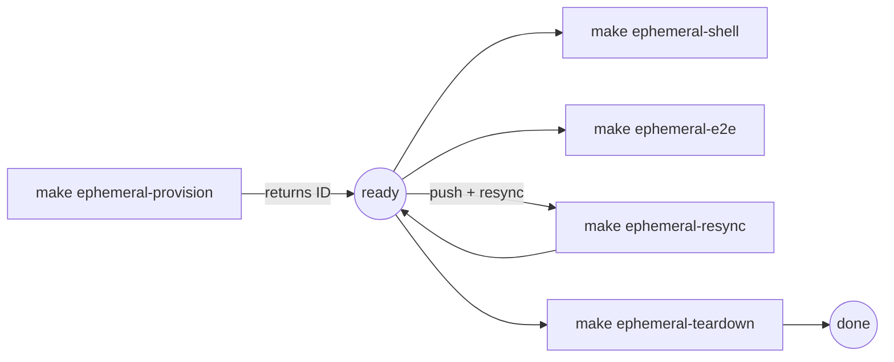
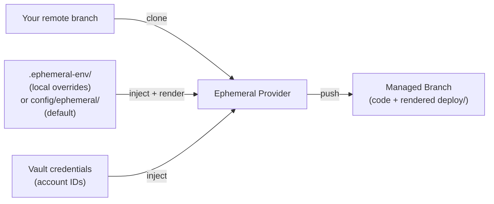
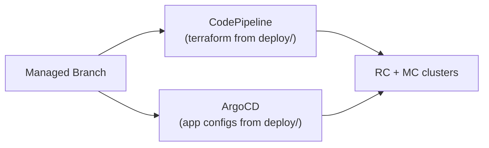
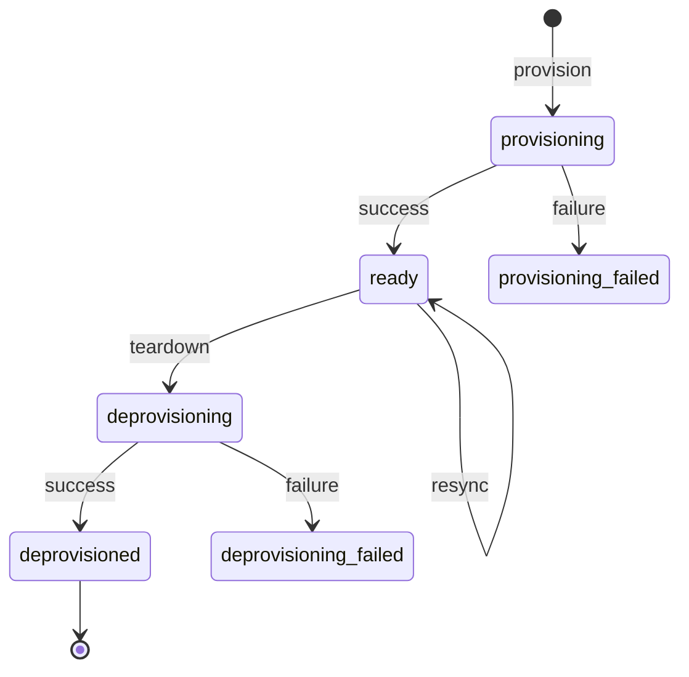
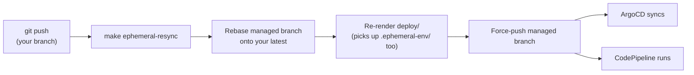
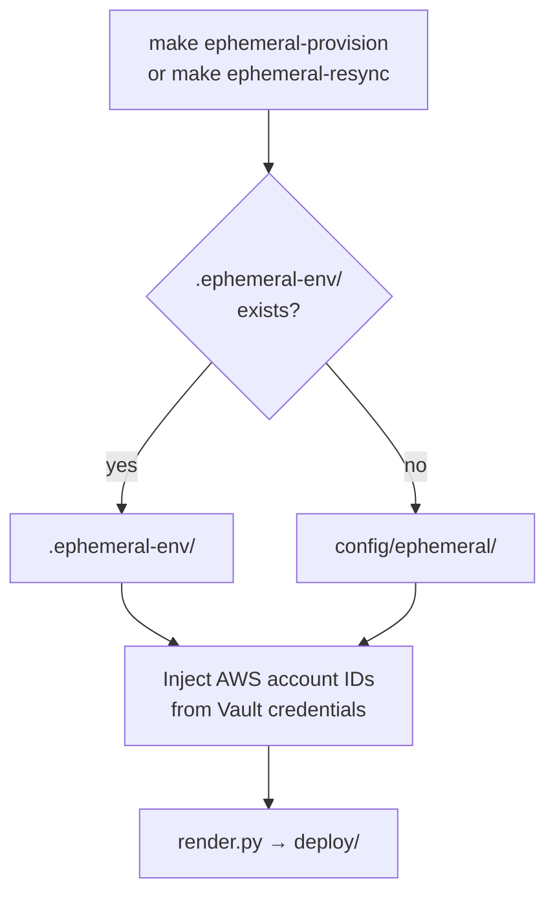

# Ephemeral Environment Visual Guide

Visual reference for how ephemeral development environments work. For usage instructions, see [Provisioning a Development Environment](development-environment.md).

## Developer Workflow



Use `make ephemeral-list` at any time to see your environments and their IDs.

## Why a Managed Branch Clone?

Both CodePipeline and ArgoCD are GitOps tools — they read from a git branch. But we can't point them at your feature branch directly because:

1. **Rendered output needs to be committed.** The `deploy/` directory is generated by `render.py`. Committing generated files to your feature branch would be noisy and conflict-prone.
2. **AWS account IDs are injected at runtime.** They come from Vault credentials and can't live in version control.
3. **Multiple envs from the same branch.** Two developers can provision from the same branch simultaneously — each gets its own managed branch.

The managed branch is a **disposable, fully-rendered deployment artifact in git**, owned by the ephemeral provider.

## How the Managed Branch Is Built



## What Consumes the Managed Branch



Resync rebases the managed branch onto your latest changes, re-renders, and force-pushes. CodePipeline and ArgoCD pick up the changes automatically.

## Environment Lifecycle



## Resync: Updating a Running Environment

The ephemeral environment runs from the managed branch, not your feature branch. When you push new commits (e.g. a Helm chart change or a Terraform module fix), the environment won't pick them up until you resync.

Resync rebases the managed branch onto your latest remote changes, re-renders the `deploy/` directory, and force-pushes. ArgoCD and CodePipeline detect the push and sync automatically.



This also re-applies your local `.ephemeral-env/` overrides, so you can change your environment topology and resync without reprovisioning.

## Overriding the Default Environment Config

By default, ephemeral environments use `config/ephemeral/` (single MC in `us-east-1`, bastion enabled). To customize, create a `.ephemeral-env/` directory in the repo root — it replaces the default entirely.

```
.ephemeral-env/          # gitignored, local to your machine
├── defaults.yaml        # optional: RC/MC defaults (bastion, instance types, ...)
└── us-east-1.yaml       # exactly one region file required
```



**Constraints:**

- Exactly one region file (besides `defaults.yaml`) — the ephemeral provisioner deploys a single region.
- At most one MC in `provision_mcs` — only one management account is available in the shared dev setup.
- Don't set AWS account IDs — they're injected automatically from credentials.

See [Customizing Your Environment](development-environment.md#customizing-your-environment) for examples.
